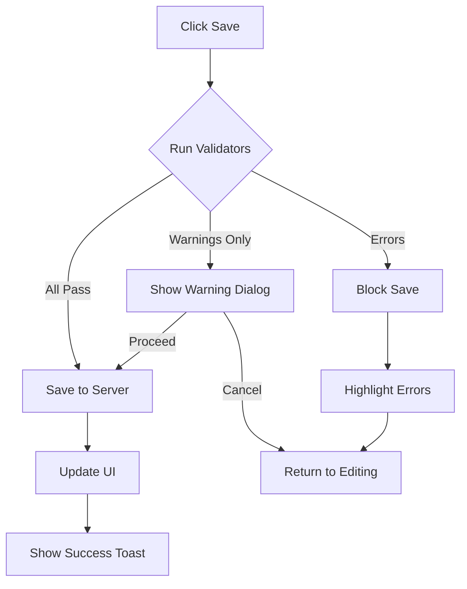

# Topic-Based Review System Architecture

**Version**: 1.0.0
**Date**: 2025-01-16
**Status**: Design Phase

## Executive Summary

This document defines the architecture for a topic-based curriculum review system that enables content managers to view and edit all resources (PDF/audio/transcripts) for a single curriculum topic in one unified interface, enabling efficient batch editing and content quality assurance.

---

## 1. System Overview

### 1.1 Purpose

Enable content reviewers to:
- View all resources for a curriculum topic together (multiple variations)
- Edit audio transcripts, PDF content, and metadata in-place
- Save changes individually or in batch
- Track editing progress and content quality
- Identify missing or incomplete content

### 1.2 Core Concepts

**Topic**: A curriculum subject (e.g., "Frases Esenciales para Entregas")
**Variation**: Different versions of the same topic (e.g., "Var 1", "Var 2", "Var 3")
**Resource Types**: PDF (markdown), Audio (MP3 + transcript), Image, Video
**Content State**: Original, Edited, Dirty (has unsaved changes)

### 1.3 Key Features

- **Unified Topic View**: All variations displayed side-by-side
- **In-Place Editing**: Edit content in actual display format
- **Batch Operations**: Save all resources at once
- **Progress Tracking**: Visual indicators for completion status
- **Content Validation**: Quality checks before saving

---

## 2. Component Architecture

### 2.1 Component Hierarchy

```
/components/topic-review/
├── TopicReviewTool.tsx              # Main orchestrator component
│   ├── TopicSelector.tsx            # Topic selection dropdown
│   ├── TopicHeader.tsx              # Topic metadata and controls
│   ├── VariationTabs.tsx            # Tab navigation for variations
│   ├── ResourceGrid.tsx             # Grid of resource previews
│   │   ├── ResourceCard.tsx         # Individual resource container
│   │   │   ├── AudioResourcePreview.tsx
│   │   │   ├── PDFResourcePreview.tsx
│   │   │   ├── TranscriptEditor.tsx
│   │   │   └── ResourceMetadataEditor.tsx
│   │   └── ResourceStatusBadge.tsx  # Edit status indicator
│   └── BatchSaveControls.tsx        # Save buttons and validation
└── hooks/
    ├── useTopicData.ts              # Fetch topic + resources
    ├── useResourceEdits.ts          # Track edits per resource
    └── useBatchSave.ts              # Coordinate batch saving
```

### 2.2 Component Specifications

#### TopicReviewTool (Main Container)

```tsx
interface TopicReviewToolProps {
  // No props - self-contained tool
}

interface TopicReviewState {
  selectedTopic: string | null;        // Topic slug
  currentVariation: number;            // Active tab index
  resources: ResourceWithEdits[];      // All resources for topic
  editStates: Map<number, EditState>;  // Track edits by resource ID
  isSaving: boolean;
  validationErrors: ValidationError[];
}
```

**Responsibilities**:
- Coordinate all child components
- Manage global state (topic selection, edit tracking)
- Handle navigation between variations
- Orchestrate batch save operations

---

#### TopicSelector

```tsx
interface TopicSelectorProps {
  onTopicSelect: (topicSlug: string) => void;
  currentTopic: string | null;
}

interface Topic {
  slug: string;              // URL-friendly identifier
  title: string;             // Display name
  category: 'repartidor' | 'conductor' | 'all';
  level: 'basico' | 'intermedio' | 'avanzado';
  variationCount: number;    // How many variations exist
  completionRate: number;    // % of resources reviewed
}
```

**Data Source**: Derive topics from resources.ts by grouping similar titles

---

#### ResourceCard + Preview Components

```tsx
interface ResourceCardProps {
  resource: Resource;
  editState: EditState;
  onEdit: (resourceId: number, content: string) => void;
  onSave: (resourceId: number) => Promise<void>;
}

interface EditState {
  isDirty: boolean;           // Has unsaved changes
  editedContent: string;      // Modified content
  originalContent: string;    // Original for comparison
  isValid: boolean;           // Passes validation
  errors: string[];
}
```

**Layout**:
```
┌─────────────────────────────────────────────┐
│ 📄 Frases Esenciales - Var 1  [●UNSAVED]   │
├─────────────────────────────────────────────┤
│ PDF Preview (Markdown rendered)             │
│ ┌─────────────────────────────────────────┐ │
│ │ # Entregas - Basic Phrases              │ │
│ │ 1. Good morning / Buenos días           │ │
│ │ [Editable markdown...]                  │ │
│ └─────────────────────────────────────────┘ │
├─────────────────────────────────────────────┤
│ 🎵 Audio Player                             │
│ [▶ Play] ━━━━━━━━━━━ 2:34 / 5:12          │
├─────────────────────────────────────────────┤
│ 📝 Transcript (editable)                    │
│ [Text editor with transcript...]            │
├─────────────────────────────────────────────┤
│ [Save Resource]  [Revert Changes]          │
└─────────────────────────────────────────────┘
```

---

#### BatchSaveControls

```tsx
interface BatchSaveControlsProps {
  dirtyResources: Resource[];     // Resources with unsaved changes
  onSaveAll: () => Promise<void>;
  onSaveIndividual: (id: number) => Promise<void>;
  onRevertAll: () => void;
}
```

**Features**:
- Show count of unsaved changes
- Validate all resources before batch save
- Display progress during multi-resource save
- Handle partial failures gracefully

---

## 3. Data Architecture

### 3.1 Topic Derivation Strategy

Since topics aren't explicitly stored, derive them from resource titles:

```typescript
interface DerivedTopic {
  slug: string;                      // "frases-esenciales-entregas"
  baseTitle: string;                 // "Frases Esenciales para Entregas"
  category: Resource['category'];
  level: Resource['level'];
  variations: ResourceGroup[];       // Grouped by variation
}

interface ResourceGroup {
  variationNumber: number;           // 1, 2, 3, etc.
  resources: Resource[];             // PDF, audio, transcript for this variation
}

// Derivation Logic
function deriveTopics(allResources: Resource[]): DerivedTopic[] {
  const grouped = groupBy(allResources, (r) => {
    // Strip variation suffix: "Frases Esenciales - Var 1" -> "Frases Esenciales"
    return r.title.replace(/\s*-\s*Var\s+\d+$/i, '').trim();
  });

  return Object.entries(grouped).map(([baseTitle, resources]) => ({
    slug: slugify(baseTitle),
    baseTitle,
    category: resources[0].category,
    level: resources[0].level,
    variations: groupByVariation(resources)
  }));
}
```

### 3.2 Data Flow Diagram

```mermaid
graph TB
    A[Resources.ts] -->|Derive Topics| B[Topic List]
    B -->|Select Topic| C[TopicReviewTool]
    C -->|Fetch Resources| D[GET /api/topics/slug]
    D -->|Load Content| E[Resource Cards]
    E -->|Edit Content| F[Local State]
    F -->|Validate| G{Valid?}
    G -->|Yes| H[Save Individual]
    G -->|Yes| I[Batch Save]
    H -->|POST| J[/api/topics/slug/save/id]
    I -->|POST| K[/api/topics/slug/save]
    K -->|Success| L[Update UI]
    K -->|Failure| M[Show Errors]
```

### 3.3 Database Schema (Supabase)

**Assumption**: Resources are stored in `resources` table with content paths.

```sql
-- Resources table (existing)
CREATE TABLE resources (
  id SERIAL PRIMARY KEY,
  title TEXT NOT NULL,
  description TEXT,
  type TEXT CHECK (type IN ('pdf', 'audio', 'image', 'video')),
  category TEXT CHECK (category IN ('all', 'repartidor', 'conductor')),
  level TEXT CHECK (level IN ('basico', 'intermedio', 'avanzado')),
  content_path TEXT,        -- Path to markdown file
  audio_url TEXT,           -- Path to audio file
  download_url TEXT,
  tags TEXT[],
  metadata JSONB,
  created_at TIMESTAMPTZ DEFAULT NOW(),
  updated_at TIMESTAMPTZ DEFAULT NOW()
);

-- Content edits tracking (new)
CREATE TABLE content_edits (
  id SERIAL PRIMARY KEY,
  resource_id INTEGER REFERENCES resources(id),
  edited_content TEXT NOT NULL,
  edited_by UUID REFERENCES auth.users(id),
  edit_type TEXT CHECK (edit_type IN ('transcript', 'pdf_content', 'metadata')),
  is_published BOOLEAN DEFAULT FALSE,
  created_at TIMESTAMPTZ DEFAULT NOW(),
  updated_at TIMESTAMPTZ DEFAULT NOW()
);

-- Index for fast topic lookups
CREATE INDEX idx_resources_title_pattern
  ON resources USING GIN (to_tsvector('english', title));

-- Index for content edits
CREATE INDEX idx_content_edits_resource
  ON content_edits(resource_id, is_published);
```

---

## 4. API Architecture

### 4.1 API Endpoints

#### GET /api/topics

**Purpose**: List all available topics with metadata

```typescript
// Request
GET /api/topics?category=repartidor&level=basico

// Response
{
  "topics": [
    {
      "slug": "frases-esenciales-entregas",
      "title": "Frases Esenciales para Entregas",
      "category": "repartidor",
      "level": "basico",
      "variationCount": 4,
      "resourceCount": 8,
      "completionRate": 0.75,  // 75% reviewed
      "lastEdited": "2025-01-15T10:30:00Z"
    }
  ]
}
```

---

#### GET /api/topics/[slug]

**Purpose**: Get all resources for a topic with content

```typescript
// Request
GET /api/topics/frases-esenciales-entregas

// Response
{
  "topic": {
    "slug": "frases-esenciales-entregas",
    "title": "Frases Esenciales para Entregas",
    "category": "repartidor",
    "level": "basico"
  },
  "variations": [
    {
      "variationNumber": 1,
      "resources": [
        {
          "id": 1,
          "title": "Frases Esenciales para Entregas - Var 1",
          "type": "pdf",
          "originalContent": "# Entregas...",
          "editedContent": "# Entregas (EDITED)...",
          "hasUnpublishedEdits": true,
          "lastEdited": "2025-01-14T15:20:00Z",
          "audioUrl": "/audio/resource-1.mp3",
          "transcript": "Good morning. Buenos días...",
          "metadata": {
            "duration": 180,
            "format": "mp3"
          }
        },
        {
          "id": 2,
          "title": "Pronunciación: Entregas - Var 1",
          "type": "audio",
          "audioUrl": "/audio/resource-2.mp3",
          "transcript": "Listen carefully...",
          "hasUnpublishedEdits": false
        }
      ]
    }
  ]
}
```

---

#### POST /api/topics/[slug]/save

**Purpose**: Batch save all edited resources for a topic

```typescript
// Request
POST /api/topics/frases-esenciales-entregas/save
{
  "edits": [
    {
      "resourceId": 1,
      "type": "pdf_content",
      "content": "# Updated content..."
    },
    {
      "resourceId": 2,
      "type": "transcript",
      "content": "Updated transcript..."
    }
  ],
  "publishImmediately": false  // Save as draft or publish
}

// Response
{
  "success": true,
  "saved": [1, 2],
  "failed": [],
  "errors": []
}
```

---

#### POST /api/topics/[slug]/save/[id]

**Purpose**: Save individual resource

```typescript
// Request
POST /api/topics/frases-esenciales-entregas/save/1
{
  "type": "transcript",
  "content": "Good morning. Buenos días...",
  "publishImmediately": true
}

// Response
{
  "success": true,
  "resourceId": 1,
  "updatedAt": "2025-01-16T09:15:00Z"
}
```

---

### 4.2 API Implementation (Route Handlers)

```typescript
// app/api/topics/route.ts
export async function GET(request: Request) {
  const { searchParams } = new URL(request.url);
  const category = searchParams.get('category');
  const level = searchParams.get('level');

  // Fetch all resources
  const resources = await db.query.resources.findMany({
    where: and(
      category ? eq(resources.category, category) : undefined,
      level ? eq(resources.level, level) : undefined
    )
  });

  // Derive topics
  const topics = deriveTopics(resources);

  return Response.json({ topics });
}

// app/api/topics/[slug]/route.ts
export async function GET(
  request: Request,
  { params }: { params: { slug: string } }
) {
  const topicSlug = params.slug;

  // Find resources matching this topic
  const resources = await fetchResourcesForTopic(topicSlug);

  // Load content for each resource
  const enrichedResources = await Promise.all(
    resources.map(async (r) => ({
      ...r,
      originalContent: await loadOriginalContent(r),
      editedContent: await loadEditedContent(r),
      hasUnpublishedEdits: await hasUnpublishedEdits(r.id)
    }))
  );

  // Group by variation
  const variations = groupByVariation(enrichedResources);

  return Response.json({
    topic: {
      slug: topicSlug,
      title: deriveTopicTitle(resources),
      category: resources[0]?.category,
      level: resources[0]?.level
    },
    variations
  });
}
```

---

## 5. State Management

### 5.1 Context Architecture

```typescript
// contexts/TopicReviewContext.tsx
interface TopicReviewContextValue {
  // Topic State
  currentTopic: DerivedTopic | null;
  currentVariation: number;
  setCurrentVariation: (index: number) => void;

  // Resource State
  resources: Map<number, ResourceWithEdits>;
  editStates: Map<number, EditState>;

  // Edit Operations
  updateResource: (id: number, content: string, type: EditType) => void;
  revertResource: (id: number) => void;
  revertAll: () => void;

  // Save Operations
  saveResource: (id: number) => Promise<void>;
  saveAllResources: () => Promise<void>;

  // Validation
  validateResource: (id: number) => ValidationResult;
  validateAll: () => ValidationResult[];

  // UI State
  isSaving: boolean;
  errors: Error[];
}

export function TopicReviewProvider({ children }: PropsWithChildren) {
  const [state, dispatch] = useReducer(topicReviewReducer, initialState);

  // ... implementation

  return (
    <TopicReviewContext.Provider value={contextValue}>
      {children}
    </TopicReviewContext.Provider>
  );
}
```

### 5.2 Custom Hooks

#### useTopicData

```typescript
export function useTopicData(topicSlug: string | null) {
  const [topic, setTopic] = useState<DerivedTopic | null>(null);
  const [loading, setLoading] = useState(false);
  const [error, setError] = useState<Error | null>(null);

  useEffect(() => {
    if (!topicSlug) return;

    async function fetchTopic() {
      setLoading(true);
      try {
        const response = await fetch(`/api/topics/${topicSlug}`);
        if (!response.ok) throw new Error('Failed to fetch topic');
        const data = await response.json();
        setTopic(data);
      } catch (err) {
        setError(err as Error);
      } finally {
        setLoading(false);
      }
    }

    fetchTopic();
  }, [topicSlug]);

  return { topic, loading, error, refetch: () => fetchTopic() };
}
```

#### useResourceEdits

```typescript
export function useResourceEdits(resourceId: number) {
  const { editStates, updateResource, revertResource } = useTopicReviewContext();

  const editState = editStates.get(resourceId) || {
    isDirty: false,
    editedContent: '',
    originalContent: '',
    isValid: true,
    errors: []
  };

  const handleEdit = useCallback((content: string, type: EditType) => {
    updateResource(resourceId, content, type);
  }, [resourceId, updateResource]);

  const handleRevert = useCallback(() => {
    revertResource(resourceId);
  }, [resourceId, revertResource]);

  return {
    editState,
    isDirty: editState.isDirty,
    isValid: editState.isValid,
    handleEdit,
    handleRevert
  };
}
```

#### useBatchSave

```typescript
export function useBatchSave() {
  const { resources, editStates, saveAllResources } = useTopicReviewContext();
  const [progress, setProgress] = useState({ current: 0, total: 0 });

  const dirtyResources = useMemo(() => {
    return Array.from(resources.values()).filter(r =>
      editStates.get(r.id)?.isDirty
    );
  }, [resources, editStates]);

  const handleBatchSave = useCallback(async () => {
    setProgress({ current: 0, total: dirtyResources.length });

    try {
      await saveAllResources();
      toast.success(`Saved ${dirtyResources.length} resources`);
    } catch (err) {
      toast.error('Batch save failed');
    }
  }, [dirtyResources, saveAllResources]);

  return {
    dirtyCount: dirtyResources.length,
    progress,
    handleBatchSave,
    canSave: dirtyResources.length > 0
  };
}
```

---

## 6. Integration with Existing Systems

### 6.1 MediaReviewTool Integration

**Relationship**: TopicReviewTool orchestrates multiple MediaReviewTool instances

```tsx
// TopicReviewTool uses MediaReviewTool for individual resources
<ResourceCard resource={resource}>
  <MediaReviewTool
    resource={resource}
    onSave={(content) => handleResourceSave(resource.id, content)}
  />
</ResourceCard>
```

**Shared Components**:
- `AudioReview` - Reused for audio playback + transcript editing
- `ContentReviewTool` - Reused for PDF/markdown editing
- `ImageReview`, `VideoReview` - Reused as-is

### 6.2 Existing API Compatibility

**Current API**: `/api/content/[id]` (single resource)
**New API**: `/api/topics/[slug]` (multiple resources)

**Strategy**: New APIs coexist with existing ones. Individual resource saves still use `/api/content/save` endpoint.

---

## 7. User Interface Design

### 7.1 Main Layout

```
┌────────────────────────────────────────────────────────────────┐
│ Topic Review Tool                                     [⚙ Settings] │
├────────────────────────────────────────────────────────────────┤
│ Topic: [Frases Esenciales para Entregas ▼]                    │
│ Category: Repartidor | Level: Básico                          │
│ Progress: ███████████░░░ 75% Complete                         │
├────────────────────────────────────────────────────────────────┤
│ Variations: [Var 1] [Var 2] [Var 3] [Var 4]   [●3 UNSAVED]  │
├────────────────────────────────────────────────────────────────┤
│ ┌─────────────────────────┐ ┌─────────────────────────┐      │
│ │ 📄 PDF Content          │ │ 🎵 Audio + Transcript   │      │
│ │ [Preview + Edit]        │ │ [Player + Edit]         │      │
│ │ [●Edited]               │ │ [✓Saved]                │      │
│ └─────────────────────────┘ └─────────────────────────┘      │
├────────────────────────────────────────────────────────────────┤
│ [Revert All Changes] [Save All (3)]                           │
└────────────────────────────────────────────────────────────────┘
```

### 7.2 Variation Navigation

**Design Options**:

1. **Tabs** (Selected):
   - Simple, familiar UX
   - Good for 2-5 variations
   - Clear active state

2. **Grid View** (Alternative):
   - All variations visible at once
   - Better for comparison
   - Requires more screen space

3. **Side-by-Side** (Future):
   - Compare variations directly
   - Advanced feature for QA

---

## 8. Performance Optimization

### 8.1 Data Loading Strategy

**Initial Load**:
1. Fetch topic metadata (fast)
2. Load variation 1 resources (prioritize)
3. Lazy load other variations on tab switch
4. Prefetch next variation in background

**Caching**:
```typescript
// Use SWR for automatic caching
import useSWR from 'swr';

export function useTopicData(slug: string) {
  const { data, error, mutate } = useSWR(
    slug ? `/api/topics/${slug}` : null,
    fetcher,
    {
      revalidateOnFocus: false,
      dedupingInterval: 60000  // 1 minute
    }
  );

  return { topic: data, loading: !data && !error, error, refresh: mutate };
}
```

### 8.2 Content Rendering Optimization

**Virtual Scrolling**: If topic has many resources, use react-window

```tsx
import { FixedSizeGrid } from 'react-window';

<FixedSizeGrid
  columnCount={2}
  rowCount={Math.ceil(resources.length / 2)}
  columnWidth={500}
  rowHeight={600}
  height={800}
  width={1100}
>
  {({ columnIndex, rowIndex, style }) => (
    <div style={style}>
      <ResourceCard resource={resources[rowIndex * 2 + columnIndex]} />
    </div>
  )}
</FixedSizeGrid>
```

### 8.3 Batch Save Optimization

**Parallel Saves**: Save resources in parallel batches

```typescript
async function batchSave(edits: ResourceEdit[]) {
  const BATCH_SIZE = 3;
  const batches = chunk(edits, BATCH_SIZE);

  for (const batch of batches) {
    await Promise.all(batch.map(edit => saveResource(edit)));
    // Update progress after each batch
    updateProgress();
  }
}
```

---

## 9. Validation & Quality Assurance

### 9.1 Content Validation Rules

```typescript
interface ValidationRule {
  name: string;
  check: (content: string, resource: Resource) => boolean;
  errorMessage: string;
  severity: 'error' | 'warning';
}

const validationRules: ValidationRule[] = [
  {
    name: 'min-length',
    check: (content) => content.length >= 100,
    errorMessage: 'Content too short (min 100 characters)',
    severity: 'error'
  },
  {
    name: 'has-translations',
    check: (content) => /español.*inglés/i.test(content),
    errorMessage: 'Missing translation pairs',
    severity: 'warning'
  },
  {
    name: 'transcript-sync',
    check: (content, resource) => {
      // Check transcript matches audio duration
      const wordCount = content.split(/\s+/).length;
      const expectedDuration = wordCount / 2.5; // ~150 wpm
      return Math.abs(expectedDuration - (resource.metadata?.duration || 0)) < 30;
    },
    errorMessage: 'Transcript length doesn\'t match audio duration',
    severity: 'warning'
  }
];
```

### 9.2 Pre-Save Validation Flow



---

## 10. Security & Access Control

### 10.1 Authentication Requirements

**Role-Based Access**:
- **Viewer**: Can view topics and resources (read-only)
- **Editor**: Can edit and save individual resources
- **Admin**: Can batch save, publish, delete

```typescript
// Middleware check
export async function authMiddleware(req: Request) {
  const session = await getServerSession();
  if (!session) {
    return new Response('Unauthorized', { status: 401 });
  }

  const user = await getUserWithRole(session.user.id);
  if (!user.roles.includes('editor') && !user.roles.includes('admin')) {
    return new Response('Forbidden', { status: 403 });
  }

  return null; // Allow
}
```

### 10.2 Data Protection

**Content Versioning**: Track all edits for audit trail

```sql
CREATE TABLE content_versions (
  id SERIAL PRIMARY KEY,
  resource_id INTEGER REFERENCES resources(id),
  version_number INTEGER NOT NULL,
  content TEXT NOT NULL,
  edited_by UUID REFERENCES auth.users(id),
  created_at TIMESTAMPTZ DEFAULT NOW()
);

-- Trigger to auto-create versions
CREATE OR REPLACE FUNCTION create_content_version()
RETURNS TRIGGER AS $$
BEGIN
  INSERT INTO content_versions (resource_id, version_number, content, edited_by)
  VALUES (
    NEW.resource_id,
    COALESCE((SELECT MAX(version_number) FROM content_versions WHERE resource_id = NEW.resource_id), 0) + 1,
    NEW.edited_content,
    NEW.edited_by
  );
  RETURN NEW;
END;
$$ LANGUAGE plpgsql;
```

---

## 11. Error Handling & Recovery

### 11.1 Error Scenarios

| Scenario | Handling Strategy |
|----------|------------------|
| Network failure during save | Retry with exponential backoff |
| Partial batch save failure | Save successful items, report failures |
| Content validation failure | Block save, show inline errors |
| Session timeout | Preserve edits in localStorage, redirect to login |
| Concurrent edits | Show conflict resolution UI |

### 11.2 Auto-Save & Recovery

```typescript
// Auto-save to localStorage every 30 seconds
useEffect(() => {
  const interval = setInterval(() => {
    const dirtyResources = Array.from(editStates.entries())
      .filter(([_, state]) => state.isDirty);

    if (dirtyResources.length > 0) {
      localStorage.setItem(
        `topic-edits-${topicSlug}`,
        JSON.stringify(dirtyResources)
      );
    }
  }, 30000);

  return () => clearInterval(interval);
}, [editStates, topicSlug]);

// Restore on mount
useEffect(() => {
  const savedEdits = localStorage.getItem(`topic-edits-${topicSlug}`);
  if (savedEdits) {
    const shouldRestore = confirm(
      'Found unsaved changes. Restore them?'
    );
    if (shouldRestore) {
      restoreEdits(JSON.parse(savedEdits));
    } else {
      localStorage.removeItem(`topic-edits-${topicSlug}`);
    }
  }
}, [topicSlug]);
```

---

## 12. Testing Strategy

### 12.1 Unit Tests

```typescript
// tests/components/TopicReviewTool.test.tsx
describe('TopicReviewTool', () => {
  it('loads topic resources on mount', async () => {
    render(<TopicReviewTool />);
    await selectTopic('frases-esenciales-entregas');

    expect(screen.getByText(/Var 1/i)).toBeInTheDocument();
    expect(screen.getByText(/Var 2/i)).toBeInTheDocument();
  });

  it('tracks edits correctly', () => {
    const { result } = renderHook(() => useResourceEdits(1));

    act(() => {
      result.current.handleEdit('New content', 'transcript');
    });

    expect(result.current.isDirty).toBe(true);
  });

  it('validates before saving', async () => {
    // Test validation rules
  });
});
```

### 12.2 Integration Tests

```typescript
// tests/api/topics.test.ts
describe('GET /api/topics/[slug]', () => {
  it('returns all resources for a topic', async () => {
    const response = await GET('/api/topics/frases-esenciales-entregas');
    const data = await response.json();

    expect(data.variations).toHaveLength(4);
    expect(data.variations[0].resources).toContainEqual(
      expect.objectContaining({ id: 1, type: 'pdf' })
    );
  });
});

describe('POST /api/topics/[slug]/save', () => {
  it('saves multiple resources in batch', async () => {
    const response = await POST('/api/topics/test/save', {
      edits: [
        { resourceId: 1, type: 'transcript', content: 'Updated' }
      ]
    });

    expect(response.status).toBe(200);
  });
});
```

---

## 13. Deployment & Rollout

### 13.1 Phased Rollout

**Phase 1: Internal Testing** (Week 1-2)
- Deploy to staging environment
- QA team tests all features
- Fix critical bugs

**Phase 2: Limited Beta** (Week 3-4)
- Select 3-5 content editors
- Gather feedback on UX
- Iterate on design

**Phase 3: Full Rollout** (Week 5)
- Deploy to production
- Monitor performance metrics
- Provide user training

### 13.2 Feature Flags

```typescript
// lib/featureFlags.ts
export const FEATURE_FLAGS = {
  TOPIC_REVIEW_TOOL: process.env.NEXT_PUBLIC_ENABLE_TOPIC_REVIEW === 'true',
  BATCH_SAVE: process.env.NEXT_PUBLIC_ENABLE_BATCH_SAVE === 'true',
  AUTO_SAVE: process.env.NEXT_PUBLIC_ENABLE_AUTO_SAVE === 'true'
} as const;

// Usage
{FEATURE_FLAGS.TOPIC_REVIEW_TOOL && <TopicReviewTool />}
```

---

## 14. Monitoring & Analytics

### 14.1 Metrics to Track

**User Behavior**:
- Topics viewed per session
- Resources edited per topic
- Save success rate (individual vs batch)
- Time spent per topic
- Validation error frequency

**Performance**:
- Page load time
- API response time (p50, p95, p99)
- Batch save duration
- Error rate by endpoint

**Business**:
- Content completion rate
- Edits published per day
- Active editors count

### 14.2 Logging

```typescript
// lib/analytics.ts
export function trackTopicEvent(event: string, data: Record<string, any>) {
  if (typeof window !== 'undefined' && window.gtag) {
    window.gtag('event', event, {
      category: 'TopicReview',
      ...data
    });
  }

  // Also log to server for analytics
  fetch('/api/analytics/track', {
    method: 'POST',
    body: JSON.stringify({ event, data })
  });
}

// Usage
trackTopicEvent('topic_opened', { slug: topicSlug, variationCount: 4 });
trackTopicEvent('batch_save_completed', { resourceCount: 3, duration: 1250 });
```

---

## 15. Future Enhancements

### 15.1 Planned Features

**v1.1** (Q2 2025):
- Side-by-side variation comparison
- Bulk import/export (CSV/JSON)
- Content templates for new variations
- Advanced search/filter

**v1.2** (Q3 2025):
- Real-time collaboration (multiple editors)
- AI-powered content suggestions
- Audio waveform visualization with timestamp markers
- Mobile-responsive editor

**v2.0** (Q4 2025):
- Full curriculum management (topics → lessons → modules)
- Student progress tracking integration
- A/B testing framework for content variations
- Multi-language support

### 15.2 Technical Debt & Refactoring

- **Type Safety**: Migrate all components to strict TypeScript
- **Accessibility**: Full WCAG 2.1 AA compliance
- **Performance**: Implement service workers for offline editing
- **Code Splitting**: Lazy load variation tabs

---

## 16. Appendix

### A. Type Definitions

```typescript
// lib/types/topic-review.ts
export interface DerivedTopic {
  slug: string;
  baseTitle: string;
  category: Resource['category'];
  level: Resource['level'];
  variations: ResourceGroup[];
  completionRate: number;
  lastEdited: string | null;
}

export interface ResourceGroup {
  variationNumber: number;
  resources: ResourceWithEdits[];
}

export interface ResourceWithEdits extends Resource {
  originalContent: string;
  editedContent: string | null;
  hasUnpublishedEdits: boolean;
  lastEdited: string | null;
}

export interface EditState {
  isDirty: boolean;
  editedContent: string;
  originalContent: string;
  isValid: boolean;
  errors: string[];
}

export type EditType = 'transcript' | 'pdf_content' | 'metadata';

export interface ValidationError {
  resourceId: number;
  field: string;
  message: string;
  severity: 'error' | 'warning';
}
```

### B. File Structure

```
/components/topic-review/
├── TopicReviewTool.tsx              # Main component
├── TopicSelector.tsx                # Topic dropdown
├── TopicHeader.tsx                  # Header with metadata
├── VariationTabs.tsx                # Tab navigation
├── ResourceGrid.tsx                 # Grid container
├── ResourceCard.tsx                 # Individual resource wrapper
├── AudioResourcePreview.tsx         # Audio player + transcript
├── PDFResourcePreview.tsx           # Markdown preview/edit
├── TranscriptEditor.tsx             # Transcript editing
├── ResourceMetadataEditor.tsx       # Edit metadata
├── ResourceStatusBadge.tsx          # Edit status indicator
├── BatchSaveControls.tsx            # Save buttons
└── ValidationErrors.tsx             # Error display

/hooks/
├── useTopicData.ts                  # Fetch topic resources
├── useResourceEdits.ts              # Track resource edits
├── useBatchSave.ts                  # Batch save coordination
└── useValidation.ts                 # Content validation

/contexts/
└── TopicReviewContext.tsx           # Global state management

/lib/topic-review/
├── topicDerivation.ts               # Extract topics from resources
├── contentValidation.ts             # Validation rules
├── batchOperations.ts               # Batch save/revert logic
└── storageService.ts                # LocalStorage management

/app/api/topics/
├── route.ts                         # GET /api/topics
├── [slug]/route.ts                  # GET /api/topics/[slug]
└── [slug]/save/
    ├── route.ts                     # POST /api/topics/[slug]/save
    └── [id]/route.ts                # POST /api/topics/[slug]/save/[id]
```

### C. Dependencies

```json
{
  "dependencies": {
    "react": "^18.2.0",
    "next": "^14.0.0",
    "swr": "^2.2.0",              // Data fetching + caching
    "react-markdown": "^9.0.0",    // Markdown rendering
    "lodash": "^4.17.21",          // Utility functions
    "date-fns": "^3.0.0",          // Date formatting
    "react-window": "^1.8.10"      // Virtual scrolling
  },
  "devDependencies": {
    "@testing-library/react": "^14.0.0",
    "@testing-library/jest-dom": "^6.1.0",
    "vitest": "^1.0.0"
  }
}
```

---

## Document Revision History

| Version | Date | Author | Changes |
|---------|------|--------|---------|
| 1.0.0 | 2025-01-16 | System Architect | Initial architecture design |

---

**End of Architecture Document**
