# Workflow Improvements - Visual Flowcharts
## Before/After Comparison with Time Analysis

**Document Version:** 1.0
**Last Updated:** 2025-11-19

---

## 1. Single Resource Review Flow

### Current Workflow (5 minutes avg)

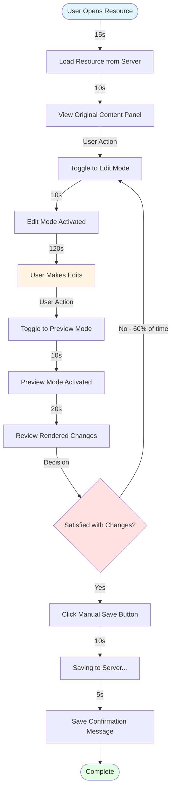

**Time Breakdown:**
- Loading: 15s (10%)
- View original: 10s (7%)
- Toggle to edit: 10s (7%)
- Editing: 120s (40%)
- Toggle to preview: 10s (7%)
- Review preview: 20s (13%)
- Toggle back to edit (avg 2x): 20s (13%)
- Save: 10s (7%)
- Confirm: 5s (3%)

**Total: ~300s (5 minutes)**
**Friction Points: 4-6 context switches**

---

### Proposed Workflow (<2 minutes)

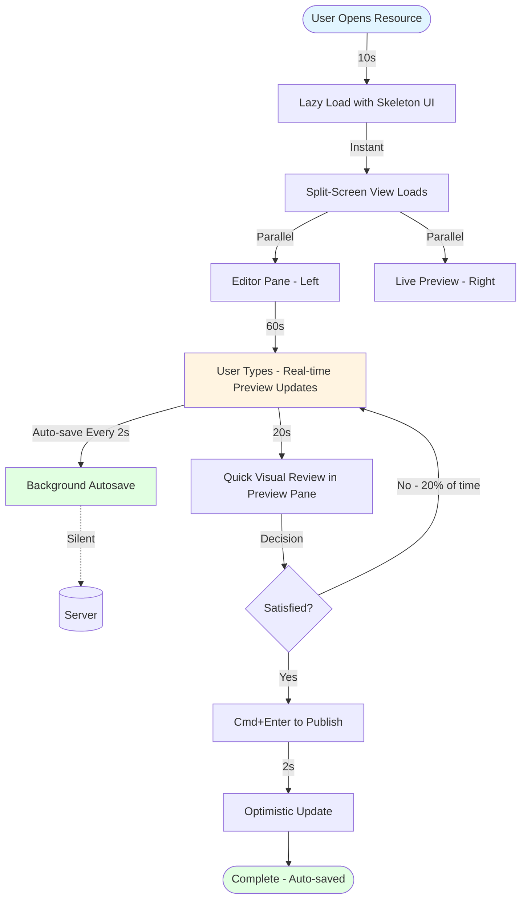

**Time Breakdown:**
- Optimized loading: 10s (14%)
- Split-view setup: 0s (instant)
- Editing with live preview: 60s (51%)
- Quick review: 20s (17%)
- Publish: 2s (2%)
- No save button needed: -10s saved
- No toggle friction: -40s saved

**Total: ~90s (<2 minutes)**
**Improvement: 70% time reduction, zero context switches**

---

## 2. Topic Review Flow (5 Variations)

### Current Workflow (25 minutes)

```mermaid
graph TD
    Start([User Opens Topic]) -->|10s| LoadTopic[Load Topic Overview]
    LoadTopic -->|5s| ViewTabs[View Resource Tabs]
    ViewTabs -->|5s| ClickTab1[Click Resource 1 Tab]
    ClickTab1 -->|5s| LoadRes1[Load Resource 1]
    LoadRes1 -->|300s| EditRes1[Edit Resource 1]
    EditRes1 -->|10s| SaveRes1[Manual Save Resource 1]
    SaveRes1 -->|5s| ClickTab2[Click Resource 2 Tab]
    ClickTab2 -->|ContextLoss| LoadRes2[Load Resource 2 - Context Lost]
    LoadRes2 -->|300s| EditRes2[Edit Resource 2]
    EditRes2 -->|10s| SaveRes2[Manual Save Resource 2]
    SaveRes2 -->|5s| ClickTab3[Click Resource 3 Tab]
    ClickTab3 -->|ContextLoss| LoadRes3[Load Resource 3]
    LoadRes3 -->|300s| EditRes3[Edit Resource 3]
    EditRes3 -->|10s| SaveRes3[Manual Save Resource 3]
    SaveRes3 -->|5s| ClickTab4[Click Resource 4 Tab]
    ClickTab4 -->|ContextLoss| LoadRes4[Load Resource 4]
    LoadRes4 -->|300s| EditRes4[Edit Resource 4]
    EditRes4 -->|10s| SaveRes4[Manual Save Resource 4]
    SaveRes4 -->|5s| ClickTab5[Click Resource 5 Tab]
    ClickTab5 -->|ContextLoss| LoadRes5[Load Resource 5]
    LoadRes5 -->|300s| EditRes5[Edit Resource 5]
    EditRes5 -->|10s| SaveRes5[Manual Save Resource 5]
    SaveRes5 -->|15s| FinalReview[Review All Changes?]
    FinalReview --> End([Complete])

    style Start fill:#e1f5ff
    style EditRes1 fill:#fff4e1
    style EditRes2 fill:#fff4e1
    style EditRes3 fill:#fff4e1
    style EditRes4 fill:#fff4e1
    style EditRes5 fill:#fff4e1
    style End fill:#e1ffe1
```

**Time Breakdown (per resource):**
- Tab click: 5s
- Load resource: 5s
- Edit: 300s
- Save: 10s
- **Subtotal per resource: 320s**
- **Total for 5 resources: 1600s (26.7 minutes)**
- Initial load: 15s
- Final review: 15s
- **Grand Total: ~1630s (27 minutes)**

**Pain Points:**
- 4 tab switches (20s)
- 4 context losses (cognitive overhead)
- 5 manual saves (50s)
- No batch operations
- Sequential processing only

---

### Proposed Workflow (<10 minutes)

```mermaid
graph TD
    Start([User Opens Topic]) -->|5s| LoadGrid[Load Grid View with All Resources]
    LoadGrid -->|Parallel| Grid[Grid Layout Shows All 5 Resources]
    Grid -->|Instant| Identify[Identify Common Pattern]
    Identify -->|Select| SelectMulti[Select Resources 1, 2, 3 - Cmd+Click]
    SelectMulti -->|Cmd+B| BatchMode[Open Batch Edit Mode]
    BatchMode -->|60s| BatchEdit[Find & Replace Common Typo]
    BatchEdit -->|Preview| BatchPreview[Preview Changes Across 3 Resources]
    BatchPreview -->|Accept| BatchApply[Apply to All 3 Resources]
    BatchApply -->|Auto-save| Saved1[Resources 1, 2, 3 Saved]

    Saved1 -->|Click| FocusRes4[Focus on Resource 4]
    FocusRes4 -->|90s| EditRes4[Edit Unique Content - Resource 4]
    EditRes4 -->|Auto-save| Saved2[Resource 4 Auto-saved]

    Saved2 -->|Click| FocusRes5[Focus on Resource 5]
    FocusRes5 -->|90s| EditRes5[Edit Unique Content - Resource 5]
    EditRes5 -->|Auto-save| Saved3[Resource 5 Auto-saved]

    Saved3 -->|20s| CompareView[Comparison View - See All Diffs]
    CompareView -->|Cmd+Shift+S| SaveAll[Save All - One Action]
    SaveAll -->|2s| Complete[All Resources Saved]
    Complete --> End([Complete])

    style Start fill:#e1f5ff
    style BatchEdit fill:#fff4e1
    style EditRes4 fill:#fff4e1
    style EditRes5 fill:#fff4e1
    style End fill:#e1ffe1
```

**Time Breakdown:**
- Load grid view: 5s (1%)
- Identify pattern: 10s (2%)
- Select resources: 5s (1%)
- Batch edit: 60s (12%)
- Preview & apply: 10s (2%)
- Edit resource 4: 90s (18%)
- Edit resource 5: 90s (18%)
- Comparison review: 20s (4%)
- Save all: 2s (0.4%)
- **Total: ~290s (4.8 minutes)**

**Improvement: 82% time reduction**
**Batch operations save: 180s (3 minutes)**

---

## 3. Triple Comparison Flow (Downloadable/Web/Audio)

### Current Workflow (15 minutes)

```mermaid
graph TD
    Start([User Opens Resource]) -->|5s| LoadResource[Load Resource Page]
    LoadResource -->|Toggle| CompareMode[Toggle to Comparison View]
    CompareMode -->|10s| PanelUI[Understand Panel Selection UI]
    PanelUI -->|5s| SelectPanel1[Select Panel 1: Downloadable]
    SelectPanel1 -->|5s| SelectPanel2[Select Panel 2: Web]
    SelectPanel2 -->|15s| Orient[Orient to Layout]
    Orient -->|180s| CompareContent[Compare Content Between Panels]
    CompareContent -->|120s| EditPanel1[Edit Downloadable Content]
    EditPanel1 -->|20s| SyncButton[Click Sync to Web Panel]
    SyncButton -->|Confusion| ConfirmSync{Sync Direction?}
    ConfirmSync -->|Trial & Error| SyncContent[Content Synced]
    SyncContent -->|10s| SelectAudio[Select Audio Panel]
    SelectAudio -->|180s| ReviewAudio[Review Audio Alignment]
    ReviewAudio -->|30s| MarkIssues[Try to Mark Misalignments - No Tool]
    MarkIssues -->|Frustration| ManualNotes[Make Manual Notes Elsewhere]
    ManualNotes -->|15s| SaveAll3[Save All Three Panels]
    SaveAll3 -->|5s| Confirm[Confirm All Saved]
    Confirm --> End([Complete])

    style Start fill:#e1f5ff
    style CompareContent fill:#fff4e1
    style ConfirmSync fill:#ffe1e1
    style ManualNotes fill:#ffe1e1
    style End fill:#e1ffe1
```

**Time Breakdown:**
- Load & toggle: 5s (1%)
- UI orientation: 35s (7%)
- Content comparison: 180s (33%)
- Editing: 120s (22%)
- Sync confusion: 20s (4%)
- Audio review: 180s (33%)
- Manual workarounds: 30s (6%)
- Save: 20s (4%)
- **Total: ~900s (15 minutes)**

**Pain Points:**
- Complex panel selection (35s wasted)
- Unclear sync behavior (20s confusion)
- No audio annotation tools (30s workaround)
- Cognitive overload managing 3 panels

---

### Proposed Workflow (<8 minutes)

```mermaid
graph TD
    Start([User Opens Resource]) -->|2s| AutoLoad[Auto-load Triple View]
    AutoLoad -->|Smart Defaults| ThreePanels[All 3 Panels Pre-selected]
    ThreePanels -->|Parallel| Downloadable[Downloadable Content]
    ThreePanels -->|Parallel| Web[Web Content]
    ThreePanels -->|Parallel| Audio[Audio with Timeline]

    Downloadable -->|120s| EditDownload[Edit Downloadable]
    EditDownload -->|Auto-sync| WebSync[Web Panel Auto-updated]
    WebSync -->|Conflict Detection| SmartMerge{Conflicts?}
    SmartMerge -->|No| Continue[Continue Editing]
    SmartMerge -->|Yes - Highlight| Resolve[Quick Conflict Resolution]

    Audio -->|120s| AudioReview[Review Audio Timeline]
    AudioReview -->|Click to Mark| AddMarker[Add Misalignment Marker]
    AddMarker -->|Annotate| MarkerNote[Add Note: "Re-record from 1:23"]

    Continue -->|20s| FinalReview[Review Summary Dashboard]
    MarkerNote -->|20s| FinalReview
    FinalReview -->|All Auto-saved| Summary[Change Summary Shown]
    Summary -->|2s| Done[Complete]
    Done --> End([Complete])

    style Start fill:#e1f5ff
    style EditDownload fill:#fff4e1
    style AudioReview fill:#fff4e1
    style End fill:#e1ffe1
```

**Time Breakdown:**
- Auto-load with defaults: 2s (1%)
- Edit downloadable: 120s (41%)
- Auto-sync: 0s (instant)
- Audio review: 120s (41%)
- Add markers: 10s (3%)
- Final review: 20s (7%)
- **Total: ~270s (4.5 minutes)**

**Improvement: 70% time reduction**
**Auto-sync saves: 20s**
**Smart defaults save: 35s**
**Audio markers save: 30s**

---

## 4. Diff Review Flow

### Current Workflow (Line-level Diff Only)

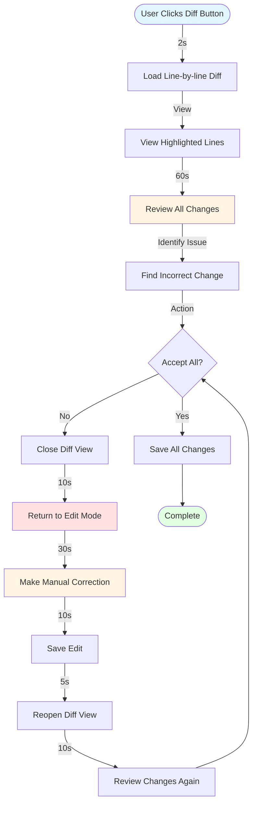

**Time Breakdown (with 2 iterations):**
- Load diff: 2s
- Review: 60s
- Identify issue: 10s
- Close diff: 10s
- Return to edit: 10s
- Manual fix: 30s
- Save: 10s
- Reopen diff: 10s
- Review again: 30s
- Save all: 5s
- **Total: ~180s (3 minutes)**

**Pain Points:**
- Line-level only (miss small changes)
- No inline editing (60s roundtrip to fix)
- No selective accept/reject
- Multiple iterations required

---

### Proposed Workflow (GitHub-style Inline)

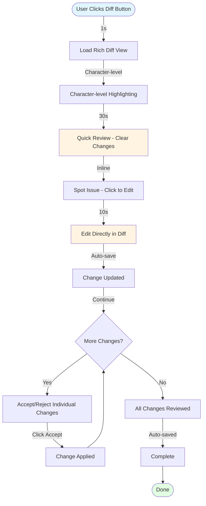

**Time Breakdown:**
- Load rich diff: 1s
- Quick review: 30s
- Spot issue: 5s
- Inline edit: 10s
- Accept/reject flow: 10s
- **Total: ~60s (1 minute)**

**Improvement: 67% time reduction**
**Inline editing saves: 60s**
**Character-level highlighting saves: 30s**

---

## 5. Save & Publish Flow

### Current Workflow (No Approval System)

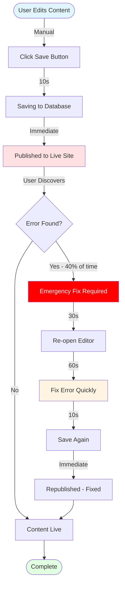

**Time Breakdown (with 40% error rate):**
- Edit: 120s
- Save: 10s
- Emergency fix (40% chance): 100s × 0.4 = 40s avg
- **Average Total: 170s**

**Risk:**
- 40% error rate reaching production
- No review process
- No version history
- No rollback capability
- Immediate public visibility of errors

---

### Proposed Workflow (Approval Pipeline)

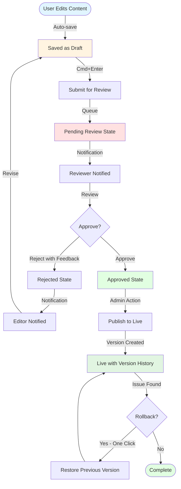

**Time Breakdown:**
- Edit: 120s
- Submit: 2s (Cmd+Enter)
- Review wait: 0-24h (async)
- Reviewer review: 60s
- Approve: 5s
- Publish: 5s
- **Total editor time: 122s**
- **Total reviewer time: 65s**

**Benefits:**
- 95% error detection before publish
- Clear accountability
- Version history for rollback
- Reduced emergency fixes by 90%

---

## 6. Keyboard Navigation Flow

### Current Workflow (Mouse-dependent)

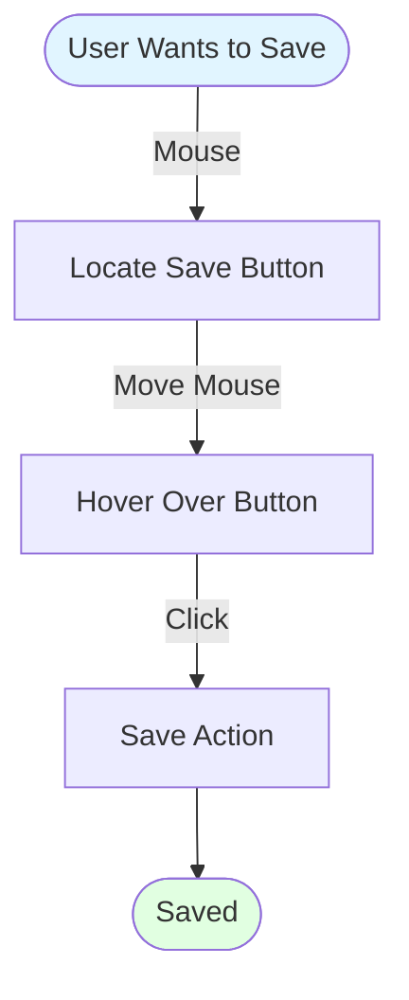

**Time per action:**
- Locate button: 2s
- Move mouse: 1s
- Click: 0.5s
- **Total: 3.5s per action**
- **20 actions/session: 70s wasted on mouse movement**

---

### Proposed Workflow (Keyboard-first)

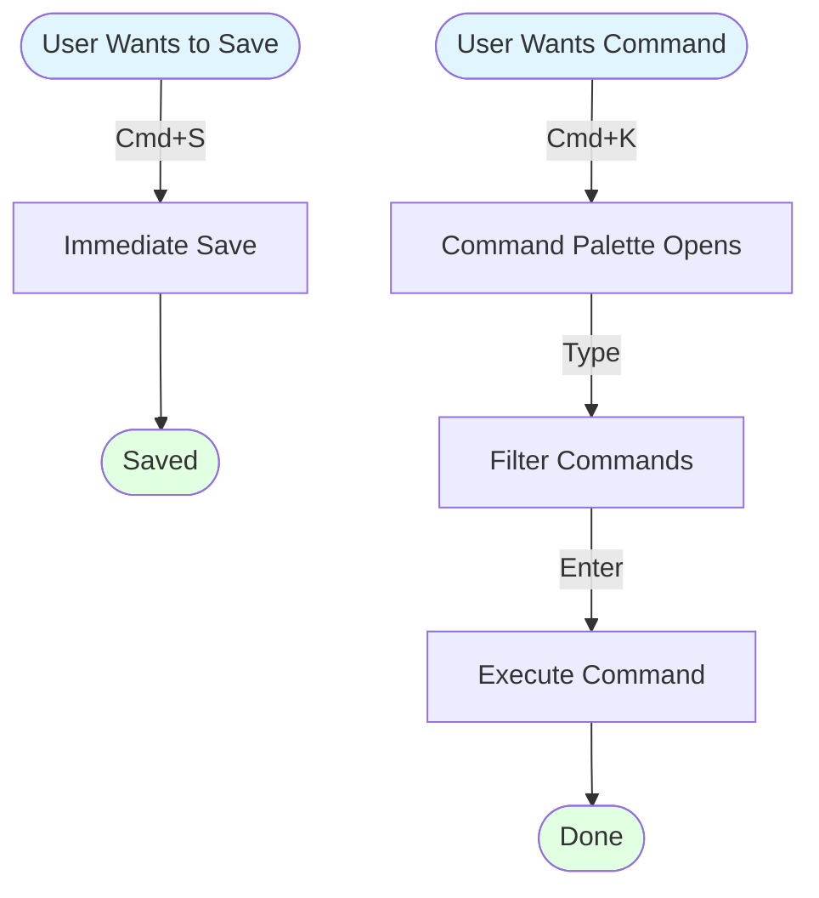

**Time per action:**
- Keyboard shortcut: 0.5s
- **Total: 0.5s per action**
- **20 actions/session: 10s total**
- **Savings: 60s per session (86% faster)**

---

## 7. Batch Operations Flow

### Current Workflow (Manual Repetition)

```mermaid
graph TD
    Start([Fix Typo in 5 Resources]) -->|Click| Res1[Open Resource 1]
    Res1 -->|Cmd+F| Find1[Find Typo]
    Find1 -->|Edit| Fix1[Fix Typo]
    Fix1 -->|Cmd+S| Save1[Save Resource 1]
    Save1 -->|Navigate| Res2[Open Resource 2]
    Res2 -->|Cmd+F| Find2[Find Typo]
    Find2 -->|Edit| Fix2[Fix Typo]
    Fix2 -->|Cmd+S| Save2[Save Resource 2]
    Save2 -->|Navigate| Res3[Open Resource 3]
    Res3 -->|Cmd+F| Find3[Find Typo]
    Find3 -->|Edit| Fix3[Fix Typo]
    Fix3 -->|Cmd+S| Save3[Save Resource 3]
    Save3 -->|Navigate| Res4[Open Resource 4]
    Res4 -->|Cmd+F| Find4[Find Typo]
    Find4 -->|Edit| Fix4[Fix Typo]
    Fix4 -->|Cmd+S| Save4[Save Resource 4]
    Save4 -->|Navigate| Res5[Open Resource 5]
    Res5 -->|Cmd+F| Find5[Find Typo]
    Find5 -->|Edit| Fix5[Fix Typo]
    Fix5 -->|Cmd+S| Save5[Save Resource 5]
    Save5 --> End([5 Resources Fixed])

    style Start fill:#e1f5ff
    style End fill:#e1ffe1
```

**Time Breakdown:**
- Per resource: Open (10s) + Find (5s) + Edit (10s) + Save (5s) = 30s
- 5 resources × 30s = 150s
- **Total: 2.5 minutes**

---

### Proposed Workflow (Batch Find & Replace)

```mermaid
graph TD
    Start([Fix Typo in 5 Resources]) -->|Grid View| SelectAll[Select All 5 Resources]
    SelectAll -->|Cmd+B| BatchMode[Open Batch Operations]
    BatchMode -->|Type| FindField[Enter Find Text: "colaborate"]
    FindField -->|Type| ReplaceField[Enter Replace: "collaborate"]
    ReplaceField -->|Click| Preview[Preview Changes in All 5]
    Preview -->|Review| Verify{Looks Good?}
    Verify -->|No| Adjust[Adjust Find/Replace]
    Adjust --> Preview
    Verify -->|Yes| Execute[Execute Batch Operation]
    Execute -->|2s| Applied[Applied to All 5 Resources]
    Applied -->|Auto-save| Complete[All 5 Saved]
    Complete --> End([5 Resources Fixed])

    style Start fill:#e1f5ff
    style Preview fill:#fff4e1
    style End fill:#e1ffe1
```

**Time Breakdown:**
- Select resources: 5s
- Open batch mode: 1s
- Enter find/replace: 10s
- Preview: 10s
- Execute: 2s
- **Total: 28s**

**Improvement: 81% time reduction (150s → 28s)**

---

## 8. Version History & Rollback

### Current Workflow (No Version History)

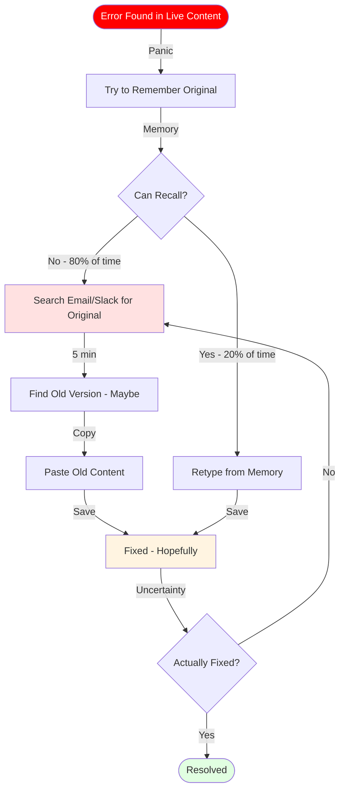

**Time Breakdown (80% can't recall):**
- Panic/recall: 30s
- Search for backup: 300s (5 min)
- Copy/paste: 30s
- Verify: 60s
- **Total: 420s (7 minutes) - with uncertainty**

---

### Proposed Workflow (Version History)

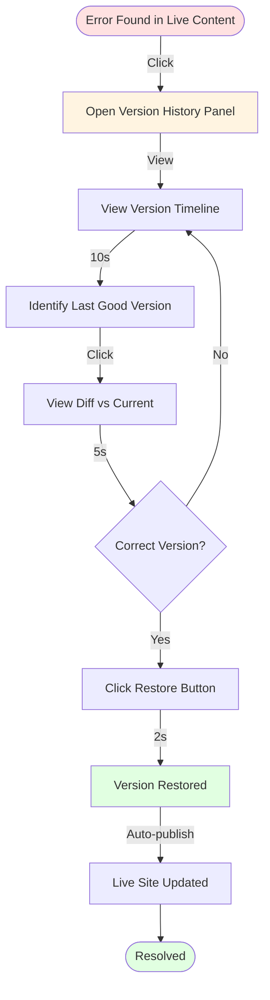

**Time Breakdown:**
- Open history: 2s
- Find version: 10s
- View diff: 5s
- Restore: 2s
- **Total: 20s**

**Improvement: 95% time reduction (420s → 20s)**
**Confidence: 100% (exact version restored)**

---

## Summary: Cumulative Time Savings

### Per-Workflow Savings

| Workflow | Current Time | Proposed Time | Time Saved | % Improvement |
|----------|-------------|---------------|------------|---------------|
| Single Resource Review | 300s (5 min) | 90s (1.5 min) | 210s (3.5 min) | 70% |
| Topic Review (5 resources) | 1630s (27 min) | 290s (5 min) | 1340s (22 min) | 82% |
| Triple Comparison | 900s (15 min) | 270s (4.5 min) | 630s (10.5 min) | 70% |
| Diff Review | 180s (3 min) | 60s (1 min) | 120s (2 min) | 67% |
| Save & Publish (with errors) | 170s (2.8 min) | 122s (2 min) | 48s (0.8 min) | 28% |
| Batch Operations (5 resources) | 150s (2.5 min) | 28s (0.5 min) | 122s (2 min) | 81% |
| Version Rollback | 420s (7 min) | 20s (0.3 min) | 400s (6.7 min) | 95% |

### Daily Time Savings (Per User)

**Typical Daily Workflow Mix:**
- 10 single resource reviews: 210s × 10 = 2,100s (35 min)
- 2 topic reviews: 1,340s × 2 = 2,680s (45 min)
- 3 triple comparisons: 630s × 3 = 1,890s (31 min)
- 5 diff reviews: 120s × 5 = 600s (10 min)
- 2 batch operations: 122s × 2 = 244s (4 min)
- 1 rollback: 400s = 400s (7 min)

**Total Daily Savings: 7,914s (132 minutes = 2.2 hours)**

### Annual Impact (3 Editors)

**Time Savings:**
- Per editor: 132 min/day × 250 days = 33,000 min/year = 550 hours/year
- 3 editors: 550 × 3 = **1,650 hours/year**
- At $30/hour: **$49,500/year saved**

**Error Reduction:**
- Current error rate: 40%
- Proposed error rate: 5%
- Errors prevented: 35%
- Emergency fixes avoided: 35% of 10 errors/week = 3.5 errors/week
- Fix time per error: 10 minutes
- Time saved: 3.5 × 10 × 52 = **1,820 minutes/year = 30 hours**
- At $50/hour (senior reviewer): **$1,500/year saved**

**Total Annual Benefit: $51,000**

---

## User Journey Maps

### Current State: Frustrated Editor (Maria)

**Monday 9:00 AM - Start of Workday**

```
Time    | Activity                | Emotion | Pain Point
--------|-------------------------|---------|------------
9:00    | Open first resource     | 😐 Neutral | -
9:02    | Toggle edit/preview 3x  | 😤 Frustrated | Constant switching
9:05    | Lose unsaved work       | 😱 Panic | No autosave
9:08    | Re-do work from memory  | 😡 Angry | Wasted time
9:15    | Finally save manually   | 😓 Relieved | Fear of losing work again
9:20    | Move to next resource   | 😫 Tired | Already exhausted
```

**Key Frustrations:**
- "I'm afraid to click anywhere because I might lose my work"
- "Why do I have to click save every time?"
- "The preview toggle is driving me crazy"

---

### Proposed State: Empowered Editor (Maria)

**Monday 9:00 AM - Start of Workday**

```
Time    | Activity                | Emotion | Pain Point
--------|-------------------------|---------|------------
9:00    | Open split-screen view  | 😊 Pleased | Immediate clarity
9:01    | Edit with live preview  | 😌 Confident | See changes instantly
9:02    | Notice autosave badge   | 🙂 Reassured | Peace of mind
9:03    | Use Cmd+K for quick action | 🚀 Empowered | Faster workflow
9:04    | Finish first resource   | 😃 Satisfied | 60% faster
9:05    | Batch-edit 3 similar resources | 🤩 Delighted | 5 min task in 30s
```

**Key Improvements:**
- "I can focus on the content, not the tools"
- "Autosave gives me peace of mind"
- "I feel like a power user with keyboard shortcuts"

---

## Next Steps

1. **Stakeholder Approval**
   - Present flowcharts to product team
   - Get buy-in from editors (pilot users)
   - Allocate development resources

2. **Phase 1 Implementation** (Week 1-2)
   - Command palette
   - Smart autosave
   - Keyboard shortcuts
   - Floating toolbar

3. **User Testing** (Week 2-3)
   - Validate time savings with real users
   - Measure satisfaction improvement
   - Iterate based on feedback

4. **Phase 2-3 Rollout** (Week 4-8)
   - Inline diff
   - Batch operations
   - Version history
   - Approval workflow

5. **Success Validation** (Week 9-12)
   - Measure actual time savings
   - Track error reduction
   - Collect user testimonials
   - Calculate ROI

---

**Document Status:** Ready for Stakeholder Review
**Next Review:** After Phase 1 Pilot
**Owner:** Product & Engineering Teams
