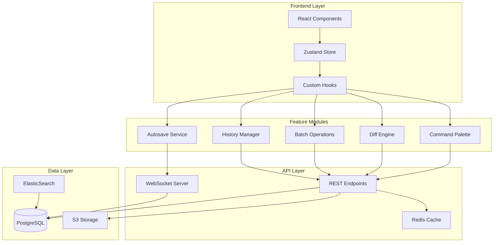

# Technical Implementation Specification
## Hablas Content Review Tool - Workflow Improvements

**Version:** 1.0
**Last Updated:** 2025-11-19

---

## Architecture Overview

### System Components



---

## Feature 1: Command Palette (Cmd+K)

### Component Structure

```typescript
// components/command-palette/CommandPalette.tsx
interface Command {
  id: string;
  label: string;
  shortcut: string;
  category: 'save' | 'view' | 'navigate' | 'edit' | 'batch';
  keywords: string[];
  handler: () => void | Promise<void>;
  icon?: React.ReactNode;
  enabled?: boolean;
}

interface CommandPaletteProps {
  isOpen: boolean;
  onClose: () => void;
  commands: Command[];
}

export const CommandPalette: React.FC<CommandPaletteProps> = ({
  isOpen,
  onClose,
  commands,
}) => {
  const [query, setQuery] = useState('');
  const [selectedIndex, setSelectedIndex] = useState(0);

  // Fuzzy search with Fuse.js
  const filteredCommands = useMemo(() => {
    if (!query) return commands;

    const fuse = new Fuse(commands, {
      keys: ['label', 'keywords'],
      threshold: 0.3,
    });

    return fuse.search(query).map(result => result.item);
  }, [query, commands]);

  // Keyboard navigation
  useKeyboardNavigation({
    items: filteredCommands,
    selectedIndex,
    onSelect: (cmd) => {
      cmd.handler();
      onClose();
    },
    onClose,
  });

  return (
    <Dialog open={isOpen} onClose={onClose}>
      <CommandPaletteUI
        query={query}
        onQueryChange={setQuery}
        commands={filteredCommands}
        selectedIndex={selectedIndex}
        onSelectIndex={setSelectedIndex}
      />
    </Dialog>
  );
};
```

### Keyboard Hook

```typescript
// hooks/useCommandPalette.ts
export const useCommandPalette = () => {
  const [isOpen, setIsOpen] = useState(false);
  const { saveResource, saveAll, toggleDiff } = useReviewActions();
  const router = useRouter();

  // Register global keyboard shortcut
  useEffect(() => {
    const handleKeyDown = (e: KeyboardEvent) => {
      if ((e.metaKey || e.ctrlKey) && e.key === 'k') {
        e.preventDefault();
        setIsOpen(true);
      }
    };

    window.addEventListener('keydown', handleKeyDown);
    return () => window.removeEventListener('keydown', handleKeyDown);
  }, []);

  const commands: Command[] = useMemo(() => [
    {
      id: 'save',
      label: 'Save Current Resource',
      shortcut: 'Cmd+S',
      category: 'save',
      keywords: ['save', 'persist', 'store'],
      handler: saveResource,
      icon: <Save className="w-4 h-4" />,
    },
    {
      id: 'save-all',
      label: 'Save All Resources',
      shortcut: 'Cmd+Shift+S',
      category: 'save',
      keywords: ['save', 'all', 'batch'],
      handler: saveAll,
      icon: <SaveAll className="w-4 h-4" />,
    },
    {
      id: 'diff',
      label: 'Toggle Diff View',
      shortcut: 'Cmd+D',
      category: 'view',
      keywords: ['diff', 'compare', 'changes'],
      handler: toggleDiff,
      icon: <GitCompare className="w-4 h-4" />,
    },
    // ... more commands
  ], [saveResource, saveAll, toggleDiff]);

  return { isOpen, setIsOpen, commands };
};
```

### Performance Optimization

```typescript
// Lazy load command palette component
const CommandPalette = lazy(() => import('./CommandPalette'));

// Preload on hover over trigger
const handleMouseEnter = () => {
  import('./CommandPalette');
};

// Render with Suspense
{isOpen && (
  <Suspense fallback={<div>Loading...</div>}>
    <CommandPalette {...props} />
  </Suspense>
)}
```

---

## Feature 2: Inline Diff Editing

### Diff Engine

```typescript
// lib/diff-engine.ts
import { diff_match_patch } from 'diff-match-patch';

interface DiffSegment {
  type: 'equal' | 'delete' | 'insert';
  text: string;
  lineNumber: number;
  characterRange: [number, number];
}

interface DiffChange {
  id: string;
  type: 'add' | 'remove' | 'modify';
  oldText?: string;
  newText: string;
  lineNumber: number;
  characterRange: [number, number];
  accepted: boolean | null; // null = pending, true = accepted, false = rejected
}

export class DiffEngine {
  private dmp: diff_match_patch;

  constructor() {
    this.dmp = new diff_match_patch();
  }

  /**
   * Compute character-level diff between two texts
   */
  computeDiff(original: string, edited: string): DiffSegment[] {
    const diffs = this.dmp.diff_main(original, edited);
    this.dmp.diff_cleanupSemantic(diffs);

    const segments: DiffSegment[] = [];
    let lineNumber = 1;
    let charIndex = 0;

    for (const [type, text] of diffs) {
      const diffType = type === 0 ? 'equal' : type === -1 ? 'delete' : 'insert';
      const lines = text.split('\n');

      lines.forEach((line, idx) => {
        segments.push({
          type: diffType,
          text: line,
          lineNumber,
          characterRange: [charIndex, charIndex + line.length],
        });

        charIndex += line.length;
        if (idx < lines.length - 1) {
          lineNumber++;
          charIndex++; // newline
        }
      });
    }

    return segments;
  }

  /**
   * Group diff segments into logical changes
   */
  groupChanges(segments: DiffSegment[]): DiffChange[] {
    const changes: DiffChange[] = [];
    let currentChange: Partial<DiffChange> | null = null;

    for (const segment of segments) {
      if (segment.type === 'equal') {
        if (currentChange) {
          changes.push(this.finalizeChange(currentChange));
          currentChange = null;
        }
      } else {
        if (!currentChange) {
          currentChange = {
            id: generateId(),
            lineNumber: segment.lineNumber,
            characterRange: segment.characterRange,
            accepted: null,
          };
        }

        if (segment.type === 'delete') {
          currentChange.oldText = (currentChange.oldText || '') + segment.text;
          currentChange.type = currentChange.newText ? 'modify' : 'remove';
        } else {
          currentChange.newText = (currentChange.newText || '') + segment.text;
          currentChange.type = currentChange.oldText ? 'modify' : 'add';
        }
      }
    }

    if (currentChange) {
      changes.push(this.finalizeChange(currentChange));
    }

    return changes;
  }

  private finalizeChange(partial: Partial<DiffChange>): DiffChange {
    return {
      id: partial.id!,
      type: partial.type!,
      oldText: partial.oldText,
      newText: partial.newText || '',
      lineNumber: partial.lineNumber!,
      characterRange: partial.characterRange!,
      accepted: partial.accepted ?? null,
    };
  }

  /**
   * Apply accepted changes to original text
   */
  applyChanges(original: string, changes: DiffChange[]): string {
    let result = original;
    const acceptedChanges = changes.filter(c => c.accepted === true);

    // Sort by character position (descending) to avoid index shifts
    acceptedChanges.sort((a, b) => b.characterRange[0] - a.characterRange[0]);

    for (const change of acceptedChanges) {
      const [start, end] = change.characterRange;

      if (change.type === 'add') {
        result = result.slice(0, start) + change.newText + result.slice(start);
      } else if (change.type === 'remove') {
        result = result.slice(0, start) + result.slice(end);
      } else if (change.type === 'modify') {
        result = result.slice(0, start) + change.newText + result.slice(end);
      }
    }

    return result;
  }
}
```

### Inline Diff Component

```typescript
// components/diff/InlineDiffView.tsx
interface InlineDiffViewProps {
  original: string;
  edited: string;
  onAcceptChange: (changeId: string) => void;
  onRejectChange: (changeId: string) => void;
  onEditChange: (changeId: string, newText: string) => void;
}

export const InlineDiffView: React.FC<InlineDiffViewProps> = ({
  original,
  edited,
  onAcceptChange,
  onRejectChange,
  onEditChange,
}) => {
  const diffEngine = useMemo(() => new DiffEngine(), []);
  const [changes, setChanges] = useState<DiffChange[]>([]);
  const [editingChangeId, setEditingChangeId] = useState<string | null>(null);

  useEffect(() => {
    const segments = diffEngine.computeDiff(original, edited);
    const groupedChanges = diffEngine.groupChanges(segments);
    setChanges(groupedChanges);
  }, [original, edited, diffEngine]);

  const handleAccept = (changeId: string) => {
    setChanges(prev =>
      prev.map(c => (c.id === changeId ? { ...c, accepted: true } : c))
    );
    onAcceptChange(changeId);
  };

  const handleReject = (changeId: string) => {
    setChanges(prev =>
      prev.map(c => (c.id === changeId ? { ...c, accepted: false } : c))
    );
    onRejectChange(changeId);
  };

  const handleEdit = (changeId: string, newText: string) => {
    setChanges(prev =>
      prev.map(c => (c.id === changeId ? { ...c, newText } : c))
    );
    onEditChange(changeId, newText);
    setEditingChangeId(null);
  };

  return (
    <div className="inline-diff-view">
      {changes.map(change => (
        <DiffChangeBlock
          key={change.id}
          change={change}
          isEditing={editingChangeId === change.id}
          onEdit={() => setEditingChangeId(change.id)}
          onSaveEdit={(text) => handleEdit(change.id, text)}
          onAccept={() => handleAccept(change.id)}
          onReject={() => handleReject(change.id)}
        />
      ))}
    </div>
  );
};
```

### Diff Change Block

```typescript
// components/diff/DiffChangeBlock.tsx
interface DiffChangeBlockProps {
  change: DiffChange;
  isEditing: boolean;
  onEdit: () => void;
  onSaveEdit: (text: string) => void;
  onAccept: () => void;
  onReject: () => void;
}

const DiffChangeBlock: React.FC<DiffChangeBlockProps> = ({
  change,
  isEditing,
  onEdit,
  onSaveEdit,
  onAccept,
  onReject,
}) => {
  const [editText, setEditText] = useState(change.newText);

  const bgColor = {
    add: 'bg-green-50 border-green-500',
    remove: 'bg-red-50 border-red-500',
    modify: 'bg-blue-50 border-blue-500',
  }[change.type];

  return (
    <div className={`border-l-4 ${bgColor} p-3 rounded-r mb-2`}>
      <div className="flex items-start gap-2">
        <span className="text-xs text-gray-500 w-12">L{change.lineNumber}</span>

        {isEditing ? (
          <input
            type="text"
            value={editText}
            onChange={(e) => setEditText(e.target.value)}
            onBlur={() => onSaveEdit(editText)}
            onKeyDown={(e) => {
              if (e.key === 'Enter') onSaveEdit(editText);
              if (e.key === 'Escape') setEditText(change.newText);
            }}
            className="flex-1 px-2 py-1 border rounded"
            autoFocus
          />
        ) : (
          <div className="flex-1">
            {change.type === 'modify' && change.oldText && (
              <span className="line-through text-red-600">{change.oldText}</span>
            )}
            {change.type === 'modify' && <span> → </span>}
            <span className={change.type === 'remove' ? 'line-through text-red-600' : ''}>
              {change.newText}
            </span>
          </div>
        )}
      </div>

      <div className="flex items-center gap-2 mt-2">
        <button
          onClick={onAccept}
          className="px-2 py-1 text-xs bg-green-600 text-white rounded hover:bg-green-700"
          disabled={change.accepted === true}
        >
          ✓ Accept
        </button>
        <button
          onClick={onReject}
          className="px-2 py-1 text-xs bg-red-600 text-white rounded hover:bg-red-700"
          disabled={change.accepted === false}
        >
          ✗ Reject
        </button>
        <button
          onClick={onEdit}
          className="px-2 py-1 text-xs bg-gray-600 text-white rounded hover:bg-gray-700"
        >
          ✏️ Edit
        </button>
      </div>
    </div>
  );
};
```

---

## Feature 3: Smart Autosave

### Autosave Hook

```typescript
// hooks/useSmartAutosave.ts
interface AutosaveConfig {
  resourceId: string;
  content: string;
  delay?: number; // milliseconds
  onSave: (content: string) => Promise<void>;
  enabled?: boolean;
}

interface AutosaveState {
  status: 'idle' | 'saving' | 'saved' | 'error' | 'conflict';
  lastSaved: Date | null;
  error: Error | null;
}

export const useSmartAutosave = ({
  resourceId,
  content,
  delay = 2000,
  onSave,
  enabled = true,
}: AutosaveConfig): AutosaveState => {
  const [state, setState] = useState<AutosaveState>({
    status: 'idle',
    lastSaved: null,
    error: null,
  });

  const lastSavedContentRef = useRef(content);
  const saveTimeoutRef = useRef<NodeJS.Timeout | null>(null);

  // Debounced autosave
  useEffect(() => {
    if (!enabled || content === lastSavedContentRef.current) {
      return;
    }

    // Clear existing timeout
    if (saveTimeoutRef.current) {
      clearTimeout(saveTimeoutRef.current);
    }

    // Schedule new save
    saveTimeoutRef.current = setTimeout(async () => {
      setState(prev => ({ ...prev, status: 'saving' }));

      try {
        await onSave(content);

        lastSavedContentRef.current = content;
        setState({
          status: 'saved',
          lastSaved: new Date(),
          error: null,
        });

        // Reset to idle after 3 seconds
        setTimeout(() => {
          setState(prev => ({ ...prev, status: 'idle' }));
        }, 3000);
      } catch (error) {
        // Check if it's a conflict error
        if (error instanceof ConflictError) {
          setState({
            status: 'conflict',
            lastSaved: state.lastSaved,
            error: error as Error,
          });
        } else {
          // Generic error - store locally for recovery
          localStorage.setItem(`recovery_${resourceId}`, JSON.stringify({
            content,
            timestamp: new Date(),
          }));

          setState({
            status: 'error',
            lastSaved: state.lastSaved,
            error: error as Error,
          });
        }
      }
    }, delay);

    return () => {
      if (saveTimeoutRef.current) {
        clearTimeout(saveTimeoutRef.current);
      }
    };
  }, [content, enabled, delay, onSave, resourceId]);

  // Restore from local storage on mount
  useEffect(() => {
    const recovered = localStorage.getItem(`recovery_${resourceId}`);
    if (recovered) {
      const { content: recoveredContent, timestamp } = JSON.parse(recovered);

      if (confirm(`Recover unsaved work from ${new Date(timestamp).toLocaleString()}?`)) {
        // Trigger recovery
        onSave(recoveredContent);
      }

      localStorage.removeItem(`recovery_${resourceId}`);
    }
  }, [resourceId]);

  return state;
};
```

### Conflict Resolution

```typescript
// components/autosave/ConflictResolver.tsx
interface ConflictResolverProps {
  localContent: string;
  remoteContent: string;
  baseContent: string; // Last common version
  onResolve: (resolved: string) => void;
  onCancel: () => void;
}

export const ConflictResolver: React.FC<ConflictResolverProps> = ({
  localContent,
  remoteContent,
  baseContent,
  onResolve,
  onCancel,
}) => {
  const [resolution, setResolution] = useState<'local' | 'remote' | 'merge'>('merge');
  const [mergedContent, setMergedContent] = useState('');

  useEffect(() => {
    // Attempt automatic 3-way merge
    const merged = threewayMerge(baseContent, localContent, remoteContent);
    setMergedContent(merged);
  }, [baseContent, localContent, remoteContent]);

  const handleResolve = () => {
    if (resolution === 'local') {
      onResolve(localContent);
    } else if (resolution === 'remote') {
      onResolve(remoteContent);
    } else {
      onResolve(mergedContent);
    }
  };

  return (
    <Dialog open onClose={onCancel}>
      <DialogTitle>Conflict Detected</DialogTitle>
      <DialogContent>
        <p className="text-sm text-gray-600 mb-4">
          Someone else modified this resource. Choose how to resolve:
        </p>

        <RadioGroup value={resolution} onChange={setResolution}>
          <Radio value="local" label="Keep My Changes" />
          <Radio value="remote" label="Use Their Changes" />
          <Radio value="merge" label="Merge Both (recommended)" />
        </RadioGroup>

        {resolution === 'merge' && (
          <div className="mt-4">
            <label className="text-sm font-medium">Merged Result:</label>
            <textarea
              value={mergedContent}
              onChange={(e) => setMergedContent(e.target.value)}
              className="w-full h-64 p-2 border rounded mt-2 font-mono text-sm"
            />
          </div>
        )}
      </DialogContent>
      <DialogActions>
        <Button onClick={onCancel}>Cancel</Button>
        <Button onClick={handleResolve} variant="primary">
          Resolve Conflict
        </Button>
      </DialogActions>
    </Dialog>
  );
};

// 3-way merge algorithm
function threewayMerge(base: string, local: string, remote: string): string {
  const dmp = new diff_match_patch();

  // Compute patches from base to local and base to remote
  const localPatches = dmp.patch_make(base, local);
  const remotePatches = dmp.patch_make(base, remote);

  // Apply both patches to base
  const [mergedLocal] = dmp.patch_apply(localPatches, base);
  const [merged] = dmp.patch_apply(remotePatches, mergedLocal);

  return merged;
}
```

---

## Feature 4: Batch Operations

### Batch Operation Manager

```typescript
// lib/batch-operations.ts
interface BatchOperation {
  type: 'find-replace' | 'metadata-update' | 'approve' | 'reject';
  resourceIds: string[];
  params: Record<string, any>;
}

interface BatchOperationResult {
  success: boolean;
  resourceId: string;
  error?: string;
}

export class BatchOperationManager {
  async execute(operation: BatchOperation): Promise<BatchOperationResult[]> {
    const results: BatchOperationResult[] = [];

    // Preview changes first
    const preview = await this.generatePreview(operation);
    const confirmed = await this.showPreviewDialog(preview);

    if (!confirmed) {
      return [];
    }

    // Execute in parallel with concurrency limit
    const concurrency = 5;
    const batches = chunk(operation.resourceIds, concurrency);

    for (const batch of batches) {
      const batchResults = await Promise.allSettled(
        batch.map(id => this.executeSingle(operation.type, id, operation.params))
      );

      batchResults.forEach((result, idx) => {
        results.push({
          success: result.status === 'fulfilled',
          resourceId: batch[idx],
          error: result.status === 'rejected' ? result.reason : undefined,
        });
      });
    }

    return results;
  }

  private async executeSingle(
    type: string,
    resourceId: string,
    params: Record<string, any>
  ): Promise<void> {
    switch (type) {
      case 'find-replace':
        return this.findReplace(resourceId, params.find, params.replace);
      case 'metadata-update':
        return this.updateMetadata(resourceId, params.metadata);
      case 'approve':
        return this.approve(resourceId);
      case 'reject':
        return this.reject(resourceId, params.reason);
      default:
        throw new Error(`Unknown operation type: ${type}`);
    }
  }

  private async findReplace(
    resourceId: string,
    find: string,
    replace: string
  ): Promise<void> {
    const resource = await api.getResource(resourceId);
    const regex = new RegExp(find, 'g');
    const newContent = resource.content.replace(regex, replace);

    await api.saveResource(resourceId, {
      content: newContent,
      changeDescription: `Batch find-replace: "${find}" → "${replace}"`,
    });
  }

  private async generatePreview(operation: BatchOperation): Promise<PreviewData> {
    // Generate preview for first 5 resources
    const sampleIds = operation.resourceIds.slice(0, 5);
    const samples = await Promise.all(
      sampleIds.map(id => this.previewSingle(operation.type, id, operation.params))
    );

    return {
      affectedCount: operation.resourceIds.length,
      samples,
    };
  }

  private async showPreviewDialog(preview: PreviewData): Promise<boolean> {
    return new Promise((resolve) => {
      // Show modal with preview
      // Resolve with user's choice
    });
  }
}
```

### Batch UI Component

```typescript
// components/batch/BatchOperationPanel.tsx
interface BatchOperationPanelProps {
  selectedResourceIds: string[];
  onComplete: () => void;
}

export const BatchOperationPanel: React.FC<BatchOperationPanelProps> = ({
  selectedResourceIds,
  onComplete,
}) => {
  const [operation, setOperation] = useState<'find-replace' | 'metadata' | 'approve'>('find-replace');
  const [findText, setFindText] = useState('');
  const [replaceText, setReplaceText] = useState('');
  const [isExecuting, setIsExecuting] = useState(false);

  const handleExecute = async () => {
    setIsExecuting(true);

    const manager = new BatchOperationManager();
    const results = await manager.execute({
      type: operation,
      resourceIds: selectedResourceIds,
      params: {
        find: findText,
        replace: replaceText,
      },
    });

    const successCount = results.filter(r => r.success).length;
    alert(`Batch operation completed: ${successCount}/${results.length} succeeded`);

    setIsExecuting(false);
    onComplete();
  };

  return (
    <div className="bg-white p-6 rounded-lg border">
      <h3 className="text-lg font-semibold mb-4">
        Batch Operations ({selectedResourceIds.length} selected)
      </h3>

      <div className="space-y-4">
        <div>
          <label className="text-sm font-medium">Operation Type</label>
          <select
            value={operation}
            onChange={(e) => setOperation(e.target.value as any)}
            className="w-full mt-1 p-2 border rounded"
          >
            <option value="find-replace">Find & Replace</option>
            <option value="metadata">Update Metadata</option>
            <option value="approve">Approve All</option>
          </select>
        </div>

        {operation === 'find-replace' && (
          <>
            <div>
              <label className="text-sm font-medium">Find</label>
              <input
                type="text"
                value={findText}
                onChange={(e) => setFindText(e.target.value)}
                className="w-full mt-1 p-2 border rounded"
                placeholder="Text to find..."
              />
            </div>
            <div>
              <label className="text-sm font-medium">Replace With</label>
              <input
                type="text"
                value={replaceText}
                onChange={(e) => setReplaceText(e.target.value)}
                className="w-full mt-1 p-2 border rounded"
                placeholder="Replacement text..."
              />
            </div>
          </>
        )}

        <button
          onClick={handleExecute}
          disabled={isExecuting || selectedResourceIds.length === 0}
          className="w-full px-4 py-2 bg-blue-600 text-white rounded hover:bg-blue-700 disabled:opacity-50"
        >
          {isExecuting ? 'Executing...' : 'Execute Batch Operation'}
        </button>
      </div>
    </div>
  );
};
```

---

## Feature 5: Version History

### Version Storage Schema

```sql
-- PostgreSQL schema
CREATE TABLE resource_versions (
  id UUID PRIMARY KEY DEFAULT gen_random_uuid(),
  resource_id INTEGER NOT NULL REFERENCES resources(id),
  version_number INTEGER NOT NULL,
  content TEXT NOT NULL,
  status VARCHAR(20) NOT NULL CHECK (status IN ('draft', 'pending', 'approved', 'published')),
  change_description TEXT,
  created_by VARCHAR(255) NOT NULL,
  created_at TIMESTAMP NOT NULL DEFAULT NOW(),
  parent_version_id UUID REFERENCES resource_versions(id),

  UNIQUE(resource_id, version_number),
  INDEX idx_resource_versions_lookup (resource_id, created_at DESC)
);

-- Automatically increment version number
CREATE OR REPLACE FUNCTION increment_version_number()
RETURNS TRIGGER AS $$
BEGIN
  SELECT COALESCE(MAX(version_number), 0) + 1
  INTO NEW.version_number
  FROM resource_versions
  WHERE resource_id = NEW.resource_id;

  RETURN NEW;
END;
$$ LANGUAGE plpgsql;

CREATE TRIGGER set_version_number
BEFORE INSERT ON resource_versions
FOR EACH ROW
EXECUTE FUNCTION increment_version_number();
```

### Version Manager

```typescript
// lib/version-manager.ts
interface Version {
  id: string;
  resourceId: number;
  versionNumber: number;
  content: string;
  status: 'draft' | 'pending' | 'approved' | 'published';
  changeDescription: string;
  createdBy: string;
  createdAt: Date;
  parentVersionId?: string;
}

export class VersionManager {
  /**
   * Get all versions for a resource
   */
  async getVersions(resourceId: number): Promise<Version[]> {
    const response = await api.get(`/api/content/${resourceId}/versions`);
    return response.data;
  }

  /**
   * Get specific version
   */
  async getVersion(versionId: string): Promise<Version> {
    const response = await api.get(`/api/versions/${versionId}`);
    return response.data;
  }

  /**
   * Compare two versions
   */
  async compareVersions(versionId1: string, versionId2: string): Promise<DiffChange[]> {
    const [v1, v2] = await Promise.all([
      this.getVersion(versionId1),
      this.getVersion(versionId2),
    ]);

    const diffEngine = new DiffEngine();
    const segments = diffEngine.computeDiff(v1.content, v2.content);
    return diffEngine.groupChanges(segments);
  }

  /**
   * Restore to previous version (creates new version)
   */
  async restore(versionId: string): Promise<Version> {
    const version = await this.getVersion(versionId);

    const response = await api.post(`/api/content/${version.resourceId}/versions`, {
      content: version.content,
      changeDescription: `Restored from v${version.versionNumber}`,
      parentVersionId: version.id,
      status: 'draft',
    });

    return response.data;
  }

  /**
   * Create new version
   */
  async createVersion(
    resourceId: number,
    content: string,
    changeDescription: string
  ): Promise<Version> {
    const response = await api.post(`/api/content/${resourceId}/versions`, {
      content,
      changeDescription,
      status: 'draft',
    });

    return response.data;
  }
}
```

### Version History UI

```typescript
// components/version-history/VersionHistoryPanel.tsx
export const VersionHistoryPanel: React.FC<{ resourceId: number }> = ({ resourceId }) => {
  const [versions, setVersions] = useState<Version[]>([]);
  const [compareMode, setCompareMode] = useState(false);
  const [selectedVersions, setSelectedVersions] = useState<string[]>([]);

  useEffect(() => {
    const manager = new VersionManager();
    manager.getVersions(resourceId).then(setVersions);
  }, [resourceId]);

  const handleRestore = async (versionId: string) => {
    if (!confirm('Restore to this version? This will create a new version.')) {
      return;
    }

    const manager = new VersionManager();
    await manager.restore(versionId);

    // Refresh versions
    const updated = await manager.getVersions(resourceId);
    setVersions(updated);
  };

  const handleCompare = () => {
    if (selectedVersions.length !== 2) {
      alert('Please select exactly 2 versions to compare');
      return;
    }

    // Open comparison view
    window.open(`/compare?v1=${selectedVersions[0]}&v2=${selectedVersions[1]}`);
  };

  return (
    <div className="bg-white p-6 rounded-lg border">
      <div className="flex items-center justify-between mb-4">
        <h3 className="text-lg font-semibold">Version History</h3>
        <button
          onClick={() => setCompareMode(!compareMode)}
          className="text-sm text-blue-600 hover:underline"
        >
          {compareMode ? 'Cancel Compare' : 'Compare Versions'}
        </button>
      </div>

      {compareMode && (
        <div className="mb-4 p-3 bg-blue-50 border border-blue-200 rounded">
          <p className="text-sm text-blue-800">
            Select 2 versions to compare ({selectedVersions.length}/2 selected)
          </p>
          <button
            onClick={handleCompare}
            disabled={selectedVersions.length !== 2}
            className="mt-2 px-3 py-1 bg-blue-600 text-white rounded text-sm disabled:opacity-50"
          >
            Compare Selected
          </button>
        </div>
      )}

      <div className="space-y-3">
        {versions.map((version) => (
          <VersionHistoryItem
            key={version.id}
            version={version}
            compareMode={compareMode}
            isSelected={selectedVersions.includes(version.id)}
            onSelect={() => {
              if (selectedVersions.includes(version.id)) {
                setSelectedVersions(prev => prev.filter(id => id !== version.id));
              } else {
                setSelectedVersions(prev => [...prev, version.id].slice(-2));
              }
            }}
            onRestore={() => handleRestore(version.id)}
          />
        ))}
      </div>
    </div>
  );
};
```

---

## Database Schema Updates

```sql
-- Add workflow status to content_edits table
ALTER TABLE content_edits
ADD COLUMN status VARCHAR(20) NOT NULL DEFAULT 'draft'
  CHECK (status IN ('draft', 'pending', 'approved', 'rejected', 'published')),
ADD COLUMN reviewed_by VARCHAR(255),
ADD COLUMN reviewed_at TIMESTAMP,
ADD COLUMN review_notes TEXT;

-- Add indexes for performance
CREATE INDEX idx_content_edits_status ON content_edits(status);
CREATE INDEX idx_content_edits_created_by ON content_edits(created_by);
CREATE INDEX idx_content_edits_reviewed_by ON content_edits(reviewed_by);

-- Approval workflow table
CREATE TABLE approval_workflows (
  id UUID PRIMARY KEY DEFAULT gen_random_uuid(),
  content_edit_id INTEGER NOT NULL REFERENCES content_edits(id),
  submitter_id VARCHAR(255) NOT NULL,
  reviewer_id VARCHAR(255),
  status VARCHAR(20) NOT NULL CHECK (status IN ('pending', 'approved', 'rejected')),
  submitted_at TIMESTAMP NOT NULL DEFAULT NOW(),
  reviewed_at TIMESTAMP,
  review_notes TEXT,

  INDEX idx_approval_workflows_status (status),
  INDEX idx_approval_workflows_reviewer (reviewer_id, status)
);
```

---

## API Endpoints

```typescript
// API routes for new features

// Command Palette - No backend needed (client-side only)

// Diff
GET /api/content/:id/diff?compareWith=:versionId
POST /api/content/:id/apply-diff
  Body: { changes: DiffChange[] }

// Batch Operations
POST /api/batch/find-replace
  Body: { resourceIds: number[], find: string, replace: string }
POST /api/batch/metadata-update
  Body: { resourceIds: number[], metadata: object }
POST /api/batch/approve
  Body: { resourceIds: number[] }

// Autosave
POST /api/content/:id/autosave
  Body: { content: string, lastModified: Date }
  Response: { saved: boolean, conflict?: Version }

// Version History
GET /api/content/:id/versions
GET /api/versions/:versionId
POST /api/content/:id/versions
  Body: { content: string, changeDescription: string }
POST /api/versions/:versionId/restore

// Approval Workflow
POST /api/reviews/submit
  Body: { contentEditId: number }
POST /api/reviews/:id/approve
  Body: { notes?: string }
POST /api/reviews/:id/reject
  Body: { notes: string }
GET /api/reviews/pending
GET /api/reviews/my-submissions
```

---

## Testing Strategy

### Unit Tests

```typescript
// __tests__/diff-engine.test.ts
describe('DiffEngine', () => {
  it('should compute character-level diff', () => {
    const engine = new DiffEngine();
    const original = 'The quick brown fox';
    const edited = 'The fast brown fox';

    const segments = engine.computeDiff(original, edited);

    expect(segments).toContainEqual({
      type: 'delete',
      text: 'quick',
      // ...
    });
    expect(segments).toContainEqual({
      type: 'insert',
      text: 'fast',
      // ...
    });
  });

  it('should group changes correctly', () => {
    const engine = new DiffEngine();
    const segments: DiffSegment[] = [
      { type: 'equal', text: 'The ', lineNumber: 1, characterRange: [0, 4] },
      { type: 'delete', text: 'quick', lineNumber: 1, characterRange: [4, 9] },
      { type: 'insert', text: 'fast', lineNumber: 1, characterRange: [4, 8] },
      { type: 'equal', text: ' brown fox', lineNumber: 1, characterRange: [8, 18] },
    ];

    const changes = engine.groupChanges(segments);

    expect(changes).toHaveLength(1);
    expect(changes[0]).toMatchObject({
      type: 'modify',
      oldText: 'quick',
      newText: 'fast',
    });
  });
});
```

### Integration Tests

```typescript
// __tests__/autosave.integration.test.ts
describe('Autosave Integration', () => {
  it('should save after debounce delay', async () => {
    const onSave = jest.fn();
    const { result } = renderHook(() =>
      useSmartAutosave({
        resourceId: '123',
        content: 'Initial content',
        delay: 100,
        onSave,
      })
    );

    // Wait for debounce
    await waitFor(() => {
      expect(onSave).toHaveBeenCalledWith('Initial content');
    }, { timeout: 200 });

    expect(result.current.status).toBe('saved');
  });

  it('should handle conflicts', async () => {
    const onSave = jest.fn().mockRejectedValue(new ConflictError());

    const { result } = renderHook(() =>
      useSmartAutosave({
        resourceId: '123',
        content: 'Conflicting content',
        delay: 100,
        onSave,
      })
    );

    await waitFor(() => {
      expect(result.current.status).toBe('conflict');
    });
  });
});
```

### E2E Tests (Playwright)

```typescript
// e2e/workflows.spec.ts
test.describe('Content Review Workflows', () => {
  test('should save resource with keyboard shortcut', async ({ page }) => {
    await page.goto('/admin/edit/123');

    // Edit content
    await page.fill('[data-testid="editor"]', 'New content');

    // Press Cmd+S
    await page.keyboard.press('Meta+S');

    // Verify save indicator
    await expect(page.locator('[data-testid="save-status"]')).toHaveText('Saved');
  });

  test('should open command palette with Cmd+K', async ({ page }) => {
    await page.goto('/admin/edit/123');

    // Open command palette
    await page.keyboard.press('Meta+K');

    // Verify palette is visible
    await expect(page.locator('[data-testid="command-palette"]')).toBeVisible();
  });

  test('should apply batch find-replace', async ({ page }) => {
    await page.goto('/admin/topics/colors');

    // Select multiple resources
    await page.check('[data-testid="resource-1"]');
    await page.check('[data-testid="resource-2"]');

    // Open batch operations
    await page.click('[data-testid="batch-operations"]');

    // Fill find-replace
    await page.fill('[data-testid="find"]', 'color');
    await page.fill('[data-testid="replace"]', 'colour');

    // Execute
    await page.click('[data-testid="execute-batch"]');

    // Verify success
    await expect(page.locator('[data-testid="batch-result"]')).toContainText('2/2 succeeded');
  });
});
```

---

## Performance Optimization

### Code Splitting

```typescript
// Lazy load heavy components
const CommandPalette = lazy(() => import('./CommandPalette'));
const DiffViewer = lazy(() => import('./DiffViewer'));
const VersionHistory = lazy(() => import('./VersionHistory'));

// Preload on interaction
const handleEditorFocus = () => {
  import('./CommandPalette');
  import('./DiffViewer');
};
```

### Memoization

```typescript
// Expensive diff computation
const diffChanges = useMemo(() => {
  const engine = new DiffEngine();
  const segments = engine.computeDiff(original, edited);
  return engine.groupChanges(segments);
}, [original, edited]);

// Command palette filtering
const filteredCommands = useMemo(() => {
  if (!query) return commands;
  return fuse.search(query).map(r => r.item);
}, [query, commands]);
```

### Debouncing

```typescript
// Autosave debounce
const debouncedSave = useMemo(
  () => debounce((content: string) => onSave(content), 2000),
  [onSave]
);

// Search debounce
const debouncedSearch = useMemo(
  () => debounce((query: string) => performSearch(query), 300),
  []
);
```

---

## Security Considerations

### Input Validation

```typescript
// Sanitize content before saving
import DOMPurify from 'dompurify';

const sanitizeContent = (content: string): string => {
  return DOMPurify.sanitize(content, {
    ALLOWED_TAGS: ['p', 'b', 'i', 'em', 'strong', 'a', 'ul', 'li', 'ol'],
    ALLOWED_ATTR: ['href', 'title'],
  });
};

// Validate batch operations
const validateBatchOperation = (op: BatchOperation): boolean => {
  if (op.resourceIds.length > 100) {
    throw new Error('Maximum 100 resources per batch');
  }

  if (op.type === 'find-replace') {
    if (!op.params.find || !op.params.replace) {
      throw new Error('Find and replace text required');
    }
  }

  return true;
};
```

### Rate Limiting

```typescript
// Rate limit autosave requests
const rateLimiter = new RateLimiter({
  maxRequests: 60, // 60 requests
  window: 60000,   // per minute
});

const autosaveWithRateLimit = async (content: string) => {
  if (!rateLimiter.tryAcquire()) {
    console.warn('Autosave rate limit exceeded, queueing...');
    // Queue for later
    return;
  }

  await api.autosave(content);
};
```

---

## Monitoring & Analytics

### Event Tracking

```typescript
// Track feature usage
const trackEvent = (event: string, properties?: object) => {
  analytics.track(event, {
    userId: currentUser.id,
    timestamp: new Date(),
    ...properties,
  });
};

// Examples
trackEvent('command_palette_opened');
trackEvent('keyboard_shortcut_used', { shortcut: 'Cmd+S' });
trackEvent('batch_operation_executed', { type: 'find-replace', resourceCount: 5 });
trackEvent('version_restored', { versionNumber: 3 });
trackEvent('diff_change_accepted', { changeType: 'modify' });
```

### Performance Metrics

```typescript
// Measure workflow completion time
const measureWorkflow = (workflowName: string) => {
  const startTime = performance.now();

  return {
    complete: () => {
      const duration = performance.now() - startTime;
      trackEvent('workflow_completed', {
        workflow: workflowName,
        duration,
      });
    },
  };
};

// Usage
const workflow = measureWorkflow('single_resource_review');
// ... perform review
workflow.complete();
```

---

## Deployment Checklist

- [ ] Database migrations applied
- [ ] API endpoints deployed
- [ ] Frontend build optimized (code splitting, minification)
- [ ] Feature flags configured
- [ ] Analytics tracking verified
- [ ] Error monitoring (Sentry) configured
- [ ] Performance monitoring enabled
- [ ] User documentation updated
- [ ] Training materials prepared
- [ ] Rollback plan documented
- [ ] A/B test configured (if applicable)
- [ ] Beta user group identified
- [ ] Feedback collection mechanism ready

---

## Rollback Plan

If critical issues arise:

1. **Disable feature flags** - Instant rollback without deployment
2. **Revert database migrations** - Use prepared rollback SQL scripts
3. **Deploy previous version** - Keep last 3 versions in production-ready state
4. **Notify users** - In-app notification about temporary reversion
5. **Collect feedback** - Gather data on what went wrong
6. **Fix and re-deploy** - Address issues and re-launch

---

## Next Steps

1. **Week 1:** Implement Priority 1 features (command palette, autosave, shortcuts)
2. **Week 2:** User testing and iteration
3. **Week 3-4:** Implement Priority 2 features (split-screen, batch ops, inline diff)
4. **Week 5-6:** Implement Priority 3 features (approval workflow, version history)
5. **Week 7-8:** Polish, performance optimization, full rollout

---

**Document Status:** Ready for Implementation
**Last Reviewed:** 2025-11-19
**Owner:** Engineering Team
