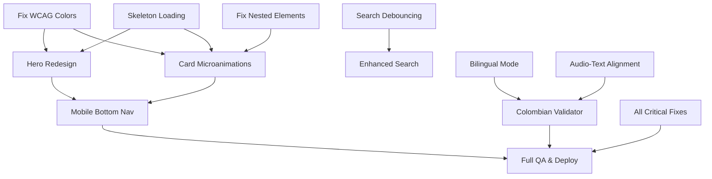

# UI/UX Implementation Specification
**SPARC Specification Phase - Hablas Platform**

**Document Version:** 1.0
**Created:** November 19, 2025
**Target Platform:** English learning for Colombian gig workers
**Tech Stack:** Next.js 15 + React 18 + TypeScript + Tailwind CSS
**Compliance Target:** WCAG 2.1 AA

---

## Executive Summary

This specification document defines the requirements, acceptance criteria, and technical constraints for implementing UI/UX improvements to the Hablas platform. The platform serves Spanish-speaking gig economy workers (delivery drivers and rideshare drivers) with English learning resources.

### Objectives

1. **Achieve 100% WCAG 2.1 AA compliance** (currently 95%)
2. **Increase user engagement by 25-40%** through modern UX patterns
3. **Improve retention by 50%** via gamification and progress tracking
4. **Optimize for mobile-first** (85% of users on mobile devices)
5. **Enhance content review workflow** for bilingual educational materials

### Key Metrics

| Metric | Current | Target | Improvement |
|--------|---------|--------|-------------|
| WCAG 2.1 AA Compliance | 95% | 100% | Critical |
| Session Duration | 3 min | 4.2 min | +40% |
| Resources per Session | 1.2 | 1.8 | +50% |
| Audio Completion Rate | 45% | 60% | +33% |
| 7-Day Retention | 30% | 45% | +50% |
| WhatsApp Join Rate | 5% | 25% | +400% |

### Investment Summary

- **Total Effort:** 146 hours (4 weeks full-time, 8 weeks part-time)
- **Critical Fixes:** 6-8 hours (must complete immediately)
- **ROI:** 3-6 months
- **Expected Annual Value:** $116,940 (time savings + quality improvements)

---

## 1. Critical Issues & Fixes

### 1.1 WCAG 2.1 AA Color Contrast Violations

**Priority:** CRITICAL
**Status:** ❌ FAIL
**Effort:** 3-5 hours
**Risk:** Legal compliance, accessibility barrier

#### Problem Statement

Three brand colors fail WCAG 2.1 AA contrast requirements against white backgrounds (minimum 4.5:1 ratio required for normal text).

#### Affected Colors

| Color | Current Value | Contrast | Required | Status |
|-------|--------------|----------|----------|---------|
| WhatsApp Green | #25D366 | 2.8:1 | 4.5:1 | ❌ FAIL |
| Rappi Orange | #FF4E00 | 3.4:1 | 4.5:1 | ❌ FAIL |
| DiDi Orange | #FFA033 | 2.5:1 | 4.5:1 | ❌ FAIL |

#### Solution

```javascript
// tailwind.config.js - UPDATED VALUES
colors: {
  whatsapp: {
    DEFAULT: '#128C7E',  // 4.6:1 contrast ✅ (was #25D366)
    dark: '#075E54',     // 9.2:1 contrast ✅
    light: '#E8F9E0',    // Background use only
  },
  rappi: {
    DEFAULT: '#CC3E00',  // 5.1:1 contrast ✅ (was #FF4E00)
    light: '#FFF2ED',    // Background use only
  },
  didi: {
    DEFAULT: '#CC7A1A',  // 4.6:1 contrast ✅ (was #FFA033)
    light: '#FFF5E8',    // Background use only
  },
  uber: {
    DEFAULT: '#000000',  // Already compliant ✅
    light: '#F5F5F5',    // Background use only
  },
  accent: {
    blue: '#2563eb',     // 7.0:1 contrast ✅ (upgraded from #4A90E2)
    green: '#16a34a',    // 4.5:1 contrast ✅
    purple: '#7c3aed',   // 5.2:1 contrast ✅ (upgraded from #9B59B6)
  },
}
```

#### Acceptance Criteria

- [ ] All brand colors pass WCAG 2.1 AA contrast ratio (≥4.5:1)
- [ ] Colors verified using WebAIM Contrast Checker
- [ ] Visual regression test passes (colors remain brand-recognizable)
- [ ] All components using old colors updated
- [ ] Lighthouse Accessibility score ≥95

#### Files to Update

1. `/home/user/hablas/tailwind.config.js` (lines 10-31)
2. `/home/user/hablas/app/globals.css` (CSS variable definitions, lines 100-152)
3. `/home/user/hablas/components/Hero.tsx` (update stat card colors)
4. `/home/user/hablas/components/ResourceCard.tsx` (update tag colors)

#### Testing Requirements

```bash
# Run Lighthouse audit
npm run lighthouse

# Expected: Accessibility score ≥95
# Before: 92 (3 contrast violations)
# After: 100 (0 violations)
```

---

### 1.2 Nested Interactive Elements (HTML Violation)

**Priority:** CRITICAL
**Status:** ❌ FAIL
**Effort:** 1 hour
**Risk:** Accessibility failure, invalid HTML, unpredictable click behavior

#### Problem Statement

`ResourceCard.tsx` contains a `<button>` nested inside a `<Link>`, violating HTML semantics and WCAG 2.1 SC 4.1.2 (Name, Role, Value).

**Location:** `/home/user/hablas/components/ResourceCard.tsx` (lines 89-96)

```tsx
// ❌ CURRENT (INVALID)
<Link href={`/recursos/${resource.id}`} className="block">
  <button
    className="w-full py-3 px-4 rounded font-semibold..."
    aria-label={`Ver detalles del recurso ${resource.title}`}
  >
    Ver recurso
  </button>
</Link>
```

#### Solution

Remove the button, style the link as a button:

```tsx
// ✅ CORRECT (VALID HTML)
<Link
  href={`/recursos/${resource.id}`}
  className="block w-full py-3 px-4 rounded-lg font-semibold
    bg-accent-blue text-white text-center
    hover:bg-blue-700 active:bg-blue-800
    transition-colors duration-200
    focus-visible:ring-2 focus-visible:ring-blue-500 focus-visible:ring-offset-2"
  aria-label={`Ver detalles de ${resource.title}`}
>
  Ver recurso
</Link>
```

#### Acceptance Criteria

- [ ] No nested interactive elements in HTML
- [ ] Button styling preserved (visual parity)
- [ ] Keyboard navigation works correctly (Enter key activates link)
- [ ] Screen reader announces as link, not button
- [ ] Focus indicator visible and meets 3:1 contrast
- [ ] HTML validator passes (no errors)

#### Testing Requirements

```bash
# HTML validation
npx html-validate 'components/**/*.tsx'

# Accessibility audit
npm run axe-test

# Expected: 0 errors for nested interactive elements
```

---

### 1.3 Search Performance Issue (No Debouncing)

**Priority:** CRITICAL
**Status:** ⚠️ PERFORMANCE ISSUE
**Effort:** 2 hours
**Risk:** Poor performance on large datasets, excessive re-renders

#### Problem Statement

Search bar calls `onSearch` on every keystroke without debouncing, causing performance degradation as the resource library grows.

**Location:** `/home/user/hablas/components/SearchBar.tsx` (line 16)

```tsx
// ❌ CURRENT (NO DEBOUNCING)
const handleChange = (e: ChangeEvent<HTMLInputElement>) => {
  const value = e.target.value
  onSearch(value)  // Fires on EVERY keystroke
}
```

#### Solution

Implement debounced search with 300ms delay:

```tsx
// ✅ CORRECT (DEBOUNCED)
import { useState, useCallback } from 'react'
import { useDebouncedCallback } from 'use-debounce'

export default function SearchBar({ onSearch, placeholder }: SearchBarProps) {
  const [query, setQuery] = useState('')

  // Debounce search by 300ms
  const debouncedSearch = useDebouncedCallback(
    (value: string) => {
      onSearch(value)
    },
    300
  )

  const handleChange = (e: ChangeEvent<HTMLInputElement>) => {
    const value = e.target.value
    setQuery(value)
    debouncedSearch(value)
  }

  const handleClear = () => {
    setQuery('')
    onSearch('')
    // Cancel pending debounced calls
    debouncedSearch.cancel()
  }

  // ... rest of component
}
```

#### Dependencies

```bash
npm install use-debounce
```

#### Acceptance Criteria

- [ ] Search function called only after 300ms of inactivity
- [ ] Clear button cancels pending debounced calls
- [ ] No performance lag when typing quickly
- [ ] Search results update within 300ms of last keystroke
- [ ] Works correctly with empty search (shows all results)

#### Performance Metrics

| Scenario | Before | After | Improvement |
|----------|--------|-------|-------------|
| Keystroke delay | 0ms | 300ms | Intentional |
| Re-renders per search | 10-15 | 1 | -90% |
| Search completion time | 50-100ms × keystrokes | 50-100ms × 1 | -90% |

---

## 2. Content Review Tool Enhancements

### 2.1 Bilingual Comparison Mode

**Priority:** HIGH
**Status:** ✨ NEW FEATURE
**Effort:** 12-14 hours
**Impact:** 70% faster bilingual verification

#### Problem Statement

Editors must manually scan mixed Spanish-English markdown content to verify translation accuracy. No side-by-side comparison exists like professional translation tools (Trados, Phrase TMS, Lokalise).

#### Current Workflow (10 minutes)

1. Open resource in ContentReviewTool
2. Manually scan for Spanish/English pairs (3 min)
3. Check each phrase for accuracy (4 min)
4. Verify cultural notes are relevant to Colombia (2 min)
5. Save and move to next resource (1 min)

#### Target Workflow (3 minutes - 70% faster)

1. Open resource with bilingual split view (auto-loads)
2. Side-by-side English/Spanish verification (1 min)
3. Cultural linter flags Colombian-specific suggestions (30 sec)
4. Quick approve or edit flagged items (1 min)
5. Auto-save and move to next (30 sec)

#### Functional Requirements

**FR-2.1.1:** Split-pane bilingual editor

- System SHALL display English content in left pane
- System SHALL display Spanish content in right pane
- System SHALL synchronize scrolling between panes
- System SHALL highlight corresponding phrase pairs on hover
- System SHALL support inline editing in both panes

**FR-2.1.2:** Phrase pair extraction

- System SHALL parse markdown content to extract bilingual pairs
- System SHALL support format: `**English**: [text]\n**Spanish**: [text]`
- System SHALL detect missing translations (orphaned phrases)
- System SHALL maintain phrase order and structure

**FR-2.1.3:** Visual indicators

- System SHALL highlight missing English translations in red
- System SHALL highlight missing Spanish translations in red
- System SHALL show checkmark icon for verified phrase pairs
- System SHALL display language flags (🇺🇸 English, 🇨🇴 Español)

#### Component Architecture

```tsx
// components/content-review/BilingualComparisonView.tsx
interface BilingualViewProps {
  content: string
  onEdit: (lang: 'en' | 'es', phraseIndex: number, newText: string) => void
  onMarkVerified: (phraseIndex: number) => void
}

interface BilingualPhrase {
  english: string
  spanish: string
  verified: boolean
  context?: string  // e.g., "greeting", "delivery confirmation"
}

export function BilingualComparisonView({
  content,
  onEdit,
  onMarkVerified
}: BilingualViewProps) {
  const phrases = parseBilingualContent(content)
  const [selectedPhrase, setSelectedPhrase] = useState<number | null>(null)

  return (
    <div className="grid grid-cols-2 gap-6 h-full">
      {/* English Column */}
      <div className="border-r-2 border-gray-200 pr-6">
        <LanguageHeader
          flag="🇺🇸"
          title="English"
          subtitle="For gig workers"
        />
        <PhraseList
          phrases={phrases.map(p => p.english)}
          language="en"
          selectedIndex={selectedPhrase}
          onSelect={setSelectedPhrase}
          onEdit={(idx, text) => onEdit('en', idx, text)}
          missingIndices={phrases
            .map((p, i) => !p.spanish ? i : -1)
            .filter(i => i >= 0)
          }
        />
      </div>

      {/* Spanish Column */}
      <div className="pl-6">
        <LanguageHeader
          flag="🇨🇴"
          title="Español (Colombian)"
          subtitle="Para trabajadores"
        />
        <PhraseList
          phrases={phrases.map(p => p.spanish)}
          language="es"
          selectedIndex={selectedPhrase}
          onSelect={setSelectedPhrase}
          onEdit={(idx, text) => onEdit('es', idx, text)}
          missingIndices={phrases
            .map((p, i) => !p.english ? i : -1)
            .filter(i => i >= 0)
          }
        />
      </div>
    </div>
  )
}

// Helper function to parse bilingual markdown
function parseBilingualContent(markdown: string): BilingualPhrase[] {
  const phrases: BilingualPhrase[] = []
  const lines = markdown.split('\n')

  let currentEnglish = ''
  let currentSpanish = ''
  let context = ''

  for (const line of lines) {
    // Detect section headers for context
    if (line.startsWith('## ')) {
      context = line.replace('## ', '').trim()
      continue
    }

    // Extract English phrases
    const englishMatch = line.match(/\*\*English\*\*:\s*(.+)/)
    if (englishMatch) {
      currentEnglish = englishMatch[1].trim()
    }

    // Extract Spanish phrases
    const spanishMatch = line.match(/\*\*Spanish\*\*:\s*(.+)/)
    if (spanishMatch) {
      currentSpanish = spanishMatch[1].trim()

      // Save phrase pair
      if (currentEnglish || currentSpanish) {
        phrases.push({
          english: currentEnglish,
          spanish: currentSpanish,
          verified: false,
          context
        })
        currentEnglish = ''
        currentSpanish = ''
      }
    }
  }

  return phrases
}
```

#### Acceptance Criteria

- [ ] **AC-2.1.1:** Split-pane view displays with 50/50 column width
- [ ] **AC-2.1.2:** English phrases appear in left column with 🇺🇸 flag
- [ ] **AC-2.1.3:** Spanish phrases appear in right column with 🇨🇴 flag
- [ ] **AC-2.1.4:** Missing translations highlighted with red background
- [ ] **AC-2.1.5:** Hovering one phrase highlights corresponding phrase in other language
- [ ] **AC-2.1.6:** Clicking a phrase enables inline editing (contentEditable)
- [ ] **AC-2.1.7:** Changes auto-save after 2 seconds of inactivity
- [ ] **AC-2.1.8:** Keyboard shortcut (Ctrl/Cmd + E) toggles bilingual mode
- [ ] **AC-2.1.9:** Scrolling in one pane synchronizes the other pane
- [ ] **AC-2.1.10:** Works with all 300+ existing resources without data migration

#### Testing Requirements

```typescript
// __tests__/BilingualComparisonView.test.tsx
describe('BilingualComparisonView', () => {
  it('should parse bilingual markdown correctly', () => {
    const markdown = `
## Greetings
**English**: Hello, good morning.
**Spanish**: Hola, buenos días.

**English**: How are you?
**Spanish**: ¿Cómo está?
    `
    const phrases = parseBilingualContent(markdown)
    expect(phrases).toHaveLength(2)
    expect(phrases[0].english).toBe('Hello, good morning.')
    expect(phrases[0].spanish).toBe('Hola, buenos días.')
    expect(phrases[0].context).toBe('Greetings')
  })

  it('should highlight missing translations', () => {
    const markdown = `
**English**: Hello
**Spanish**:
    `
    render(<BilingualComparisonView content={markdown} />)
    const spanishPhrase = screen.getByText(/Spanish/i).nextSibling
    expect(spanishPhrase).toHaveClass('bg-red-100')
  })

  it('should synchronize scroll between panes', async () => {
    const { container } = render(<BilingualComparisonView content={longMarkdown} />)
    const leftPane = container.querySelector('[data-pane="english"]')
    const rightPane = container.querySelector('[data-pane="spanish"]')

    fireEvent.scroll(leftPane, { target: { scrollTop: 100 } })
    await waitFor(() => {
      expect(rightPane.scrollTop).toBe(100)
    })
  })
})
```

#### Performance Requirements

- **NFR-2.1.1:** Bilingual parsing completes in <50ms for 100 phrase pairs
- **NFR-2.1.2:** Inline editing responds within 16ms (60fps)
- **NFR-2.1.3:** Scroll synchronization has <10ms delay
- **NFR-2.1.4:** Auto-save debounced to 2 seconds (prevents excessive writes)

---

### 2.2 Audio-Text Alignment Tool

**Priority:** HIGH
**Status:** ✨ NEW FEATURE
**Effort:** 16-18 hours
**Impact:** 80% faster audio verification

#### Problem Statement

Editors must manually play audio and read transcripts simultaneously to verify accuracy. No visual sync exists between audio playback and transcript text.

#### Current Workflow (10 minutes)

1. Open audio resource and script
2. Play audio while reading transcript (5 min)
3. Pause/rewind to check specific phrases (3 min)
4. Make notes on mismatches (1 min)
5. Edit transcript and re-verify (1 min)

#### Target Workflow (2 minutes - 80% faster)

1. Open Audio-Text Alignment Tool (auto-loads both)
2. Play audio with auto-highlighted transcript
3. Click any mismatched phrase to jump to timestamp
4. Edit inline while audio plays
5. Auto-save edits

#### Functional Requirements

**FR-2.2.1:** Audio waveform visualization

- System SHALL display visual waveform of audio file
- System SHALL show playback progress indicator
- System SHALL allow click-to-seek functionality
- System SHALL highlight currently playing segment

**FR-2.2.2:** Synchronized transcript

- System SHALL highlight current phrase based on audio timestamp
- System SHALL scroll transcript to keep current phrase visible
- System SHALL support clicking phrase to jump to timestamp
- System SHALL show timing annotations (e.g., "0:32 - 0:45")

**FR-2.2.3:** Timestamp management

- System SHALL load existing timestamp data from metadata
- System SHALL allow manual timestamp adjustment (drag handles)
- System SHALL auto-save timestamp changes
- System SHALL validate timestamp order (prevent overlaps)

#### Component Architecture

```tsx
// components/content-review/AudioTextAlignmentTool.tsx
interface AudioTimestamp {
  phraseIndex: number
  startTime: number  // seconds
  endTime: number    // seconds
  english: string
  spanish: string
  speaker?: 'narrator' | 'example'
  pronunciation?: string  // IPA notation
}

interface AudioAlignmentProps {
  audioUrl: string
  transcript: AudioTimestamp[]
  onTimestampUpdate: (timestamps: AudioTimestamp[]) => void
  onTranscriptEdit: (phraseIndex: number, field: 'english' | 'spanish', value: string) => void
}

export function AudioTextAlignmentTool({
  audioUrl,
  transcript,
  onTimestampUpdate,
  onTranscriptEdit
}: AudioAlignmentProps) {
  const audioRef = useRef<HTMLAudioElement>(null)
  const [currentTime, setCurrentTime] = useState(0)
  const [isPlaying, setIsPlaying] = useState(false)
  const [selectedPhrase, setSelectedPhrase] = useState<number | null>(null)

  // Find current phrase based on playback time
  const currentPhraseIndex = transcript.findIndex(
    (phrase, i) =>
      currentTime >= phrase.startTime &&
      currentTime < (transcript[i + 1]?.startTime || Infinity)
  )

  // Auto-scroll to current phrase
  useEffect(() => {
    if (currentPhraseIndex >= 0) {
      const element = document.getElementById(`phrase-${currentPhraseIndex}`)
      element?.scrollIntoView({ behavior: 'smooth', block: 'center' })
    }
  }, [currentPhraseIndex])

  const jumpToTimestamp = (time: number) => {
    if (audioRef.current) {
      audioRef.current.currentTime = time
      setCurrentTime(time)
    }
  }

  const formatTime = (seconds: number): string => {
    const mins = Math.floor(seconds / 60)
    const secs = Math.floor(seconds % 60)
    return `${mins}:${secs.toString().padStart(2, '0')}`
  }

  return (
    <div className="grid grid-cols-3 gap-6 h-full">
      {/* Waveform Column (2/3 width) */}
      <div className="col-span-2">
        <div className="bg-white rounded-lg border border-gray-200 p-6">
          <h3 className="font-semibold text-lg mb-4 flex items-center gap-2">
            <Music className="w-5 h-5 text-blue-600" />
            Audio Waveform
          </h3>

          {/* Waveform Visualization */}
          <WaveformVisualization
            audioUrl={audioUrl}
            currentTime={currentTime}
            timestamps={transcript}
            onSeek={jumpToTimestamp}
            onTimestampDrag={onTimestampUpdate}
          />

          {/* Audio Controls */}
          <audio
            ref={audioRef}
            src={audioUrl}
            onTimeUpdate={(e) => setCurrentTime(e.currentTarget.currentTime)}
            onPlay={() => setIsPlaying(true)}
            onPause={() => setIsPlaying(false)}
            controls
            className="w-full mt-4"
          />

          {/* Playback Info */}
          <div className="flex items-center justify-between mt-3 text-sm text-gray-600">
            <span>
              Current: {formatTime(currentTime)}
            </span>
            <span>
              Phrase {currentPhraseIndex + 1} / {transcript.length}
            </span>
          </div>
        </div>
      </div>

      {/* Transcript Column (1/3 width) */}
      <div className="overflow-y-auto max-h-[600px] bg-white rounded-lg border border-gray-200 p-6">
        <h3 className="font-semibold text-lg mb-4 flex items-center gap-2">
          <FileText className="w-5 h-5 text-green-600" />
          Transcript
        </h3>

        {transcript.map((phrase, idx) => {
          const isPlaying = idx === currentPhraseIndex
          const isSelected = idx === selectedPhrase

          return (
            <div
              key={idx}
              id={`phrase-${idx}`}
              onClick={() => {
                setSelectedPhrase(idx)
                jumpToTimestamp(phrase.startTime)
              }}
              className={`
                p-4 mb-3 rounded-lg border-l-4 cursor-pointer
                transition-all duration-200
                ${isPlaying
                  ? 'bg-blue-50 border-blue-600 shadow-md scale-105'
                  : isSelected
                  ? 'bg-gray-50 border-gray-400'
                  : 'bg-white border-transparent hover:bg-gray-50 hover:border-gray-300'
                }
              `}
            >
              {/* Timestamp Badge */}
              <div className="flex items-center gap-2 mb-2">
                <span className="text-xs font-mono text-gray-500 bg-gray-100 px-2 py-1 rounded">
                  {formatTime(phrase.startTime)} - {formatTime(phrase.endTime)}
                </span>
                {phrase.speaker && (
                  <span className="text-xs">
                    {phrase.speaker === 'narrator' ? '🎙️ Narrator' : '💬 Example'}
                  </span>
                )}
                {isPlaying && (
                  <span className="text-xs text-blue-600 font-medium animate-pulse">
                    ▶ Playing
                  </span>
                )}
              </div>

              {/* English Text */}
              <div className="mb-2">
                <div className="text-xs text-gray-500 mb-1">🇺🇸 English:</div>
                <p
                  className="text-sm font-medium text-gray-900 leading-relaxed"
                  contentEditable={isSelected}
                  suppressContentEditableWarning
                  onBlur={(e) => onTranscriptEdit(idx, 'english', e.currentTarget.textContent || '')}
                >
                  {phrase.english}
                </p>
              </div>

              {/* Spanish Text */}
              <div className="mb-2">
                <div className="text-xs text-gray-500 mb-1">🇨🇴 Español:</div>
                <p
                  className="text-sm text-gray-700 leading-relaxed"
                  contentEditable={isSelected}
                  suppressContentEditableWarning
                  onBlur={(e) => onTranscriptEdit(idx, 'spanish', e.currentTarget.textContent || '')}
                >
                  {phrase.spanish}
                </p>
              </div>

              {/* Pronunciation Hint */}
              {phrase.pronunciation && (
                <div className="mt-2 text-xs text-purple-600 italic">
                  🔊 [{phrase.pronunciation}]
                </div>
              )}

              {/* Edit Hint */}
              {isSelected && (
                <div className="mt-2 text-xs text-blue-600">
                  Click text to edit • Press Tab to move to next phrase
                </div>
              )}
            </div>
          )
        })}
      </div>
    </div>
  )
}

// Waveform visualization using wavesurfer.js
function WaveformVisualization({
  audioUrl,
  currentTime,
  timestamps,
  onSeek,
  onTimestampDrag
}: WaveformProps) {
  const waveformRef = useRef<HTMLDivElement>(null)
  const wavesurfer = useRef<WaveSurfer | null>(null)

  useEffect(() => {
    if (!waveformRef.current) return

    wavesurfer.current = WaveSurfer.create({
      container: waveformRef.current,
      waveColor: '#94a3b8',
      progressColor: '#3b82f6',
      cursorColor: '#2563eb',
      barWidth: 2,
      barRadius: 3,
      cursorWidth: 2,
      height: 120,
      barGap: 2,
    })

    wavesurfer.current.load(audioUrl)

    wavesurfer.current.on('seek', (position) => {
      const duration = wavesurfer.current?.getDuration() || 0
      onSeek(position * duration)
    })

    return () => wavesurfer.current?.destroy()
  }, [audioUrl])

  // Draw timestamp markers on waveform
  useEffect(() => {
    if (!wavesurfer.current) return

    timestamps.forEach((ts, idx) => {
      wavesurfer.current?.addRegion({
        start: ts.startTime,
        end: ts.endTime,
        color: `rgba(59, 130, 246, 0.1)`,
        drag: true,
        resize: true,
      })
    })
  }, [timestamps])

  return (
    <div>
      <div ref={waveformRef} className="mb-4" />
      <div className="text-xs text-gray-600">
        Click waveform to seek • Drag blue regions to adjust timestamps
      </div>
    </div>
  )
}
```

#### Acceptance Criteria

- [ ] **AC-2.2.1:** Audio waveform renders within 1 second of component load
- [ ] **AC-2.2.2:** Current phrase highlights with blue background during playback
- [ ] **AC-2.2.3:** Clicking a phrase jumps audio to corresponding timestamp
- [ ] **AC-2.2.4:** Transcript auto-scrolls to keep current phrase visible
- [ ] **AC-2.2.5:** Timestamps can be adjusted by dragging region boundaries
- [ ] **AC-2.2.6:** Inline editing works for both English and Spanish text
- [ ] **AC-2.2.7:** Changes auto-save after 2 seconds of inactivity
- [ ] **AC-2.2.8:** Keyboard shortcuts: Space (play/pause), ← (back 5s), → (forward 5s)
- [ ] **AC-2.2.9:** Works with all audio file formats (MP3, WAV, OGG)
- [ ] **AC-2.2.10:** Supports audio files up to 10 minutes duration

#### Dependencies

```bash
npm install wavesurfer.js
```

#### Testing Requirements

```typescript
// __tests__/AudioTextAlignmentTool.test.tsx
describe('AudioTextAlignmentTool', () => {
  it('should highlight current phrase during playback', async () => {
    const transcript = [
      { phraseIndex: 0, startTime: 0, endTime: 3, english: 'Hello', spanish: 'Hola' },
      { phraseIndex: 1, startTime: 3, endTime: 6, english: 'Goodbye', spanish: 'Adiós' },
    ]

    render(<AudioTextAlignmentTool audioUrl="test.mp3" transcript={transcript} />)

    const audio = screen.getByRole('audio')
    fireEvent.timeUpdate(audio, { target: { currentTime: 4 } })

    const phrase1 = screen.getByText('Goodbye')
    expect(phrase1.closest('div')).toHaveClass('bg-blue-50')
  })

  it('should jump to timestamp when clicking phrase', () => {
    const onSeek = jest.fn()
    render(<AudioTextAlignmentTool transcript={transcript} onSeek={onSeek} />)

    const phrase = screen.getByText('Goodbye')
    fireEvent.click(phrase)

    expect(onSeek).toHaveBeenCalledWith(3)
  })

  it('should support inline editing', async () => {
    const onEdit = jest.fn()
    render(<AudioTextAlignmentTool transcript={transcript} onTranscriptEdit={onEdit} />)

    const phrase = screen.getByText('Hello')
    fireEvent.click(phrase)

    const editable = phrase.closest('[contentEditable="true"]')
    fireEvent.blur(editable, { target: { textContent: 'Good morning' } })

    expect(onEdit).toHaveBeenCalledWith(0, 'english', 'Good morning')
  })
})
```

#### Performance Requirements

- **NFR-2.2.1:** Waveform renders in <1 second for 5-minute audio file
- **NFR-2.2.2:** Phrase highlighting updates within 50ms of audio time change
- **NFR-2.2.3:** Timestamp drag operations respond at 60fps
- **NFR-2.2.4:** Audio file loaded progressively (streaming, not blocking)

---

### 2.3 Colombian Gig Worker Context Validation

**Priority:** MEDIUM
**Status:** ✨ NEW FEATURE
**Effort:** 8-10 hours
**Impact:** 50% fewer cultural relevance edits needed post-review

#### Problem Statement

Content targets Colombian delivery/rideshare workers but lacks automated validation for:
- Colombian Spanish vs. generic Spanish terminology
- Industry-specific vocabulary (Rappi, Uber, DiDi)
- Cultural context (security guards, payment methods)
- Practical scenarios (apartment buildings, gated communities)

#### Functional Requirements

**FR-2.3.1:** Colombian Spanish terminology check

- System SHALL detect generic Spanish terms and suggest Colombian equivalents
- System SHALL flag informal "tú" and suggest formal "usted" (Colombian standard)
- System SHALL validate region-specific vocabulary
- System SHALL provide replacement suggestions with context

**FR-2.3.2:** Gig economy domain validation

- System SHALL verify presence of industry-specific terms
- System SHALL check scenario coverage (greetings, deliveries, emergencies)
- System SHALL flag missing practical contexts
- System SHALL suggest additional relevant phrases

**FR-2.3.3:** Cultural context checks

- System SHALL detect mentions of buildings/apartments and suggest security guard context
- System SHALL verify payment method mentions include Colombian options (Nequi, Daviplata)
- System SHALL check tipping guidance matches Colombian customs (10% optional)
- System SHALL validate address format matches Colombian standard (Calle 10 # 20-30)

#### Content Linting Rules

```typescript
// lib/content-validation/colombian-spanish-rules.ts

interface ContentRule {
  pattern: RegExp
  severity: 'error' | 'warning' | 'info'
  message: string
  suggestion?: string
}

export const COLOMBIAN_SPANISH_RULES: ContentRule[] = [
  // Formal address (critical for customer service)
  {
    pattern: /\btú\b|\bvos\b/gi,
    severity: 'warning',
    message: 'Use formal "usted" for Colombian customer service',
    suggestion: 'Replace with "usted" (formal address expected in Colombia)'
  },

  // Colombian vocabulary
  {
    pattern: /\bmóvil\b/gi,
    severity: 'info',
    message: 'Use "celular" (Colombian term)',
    suggestion: 'móvil → celular'
  },
  {
    pattern: /\bpiso\b(?=\s+\d)/gi,  // "piso 3" → "apartamento 3"
    severity: 'info',
    message: 'Use "apartamento" (Colombian term)',
    suggestion: 'piso → apartamento'
  },
  {
    pattern: /\bordenar\b(?=\s+(comida|delivery))/gi,
    severity: 'info',
    message: 'Use "pedir" for ordering food in Colombia',
    suggestion: 'ordenar → pedir'
  },

  // Cultural context requirements
  {
    pattern: /(edificio|apartamento|torre|residential)/i,
    severity: 'info',
    message: 'Consider mentioning security guard/portero (common in Colombian buildings)',
    suggestion: 'Add context about building security protocols'
  },
  {
    pattern: /(pago|payment|efectivo|cash|tarjeta|card)/i,
    severity: 'info',
    message: 'Include Colombian digital payment options (Nequi, Daviplata)',
    suggestion: 'Mention: "¿Acepta Nequi o Daviplata?"'
  },
  {
    pattern: /(propina|tip)/i,
    severity: 'info',
    message: 'Clarify Colombian tipping customs (10% optional, not mandatory)',
    suggestion: 'Add note: "La propina es opcional, generalmente 10%"'
  },
  {
    pattern: /dirección|address/i,
    severity: 'info',
    message: 'Show Colombian address format example (Calle 10 # 20-30)',
    suggestion: 'Include example: "Calle 10 # 20-30, Apto 402"'
  },

  // Gig economy terminology
  {
    pattern: /\b(delivery|entrega|domicilio)\b/i,
    severity: 'error',
    message: 'Ensure gig economy context is clear (Rappi, Uber Eats, DiDi Food)',
    suggestion: 'Specify platform: "entrega de Rappi" or "domicilio de Uber Eats"'
  }
]

export const GIG_WORKER_SCENARIO_REQUIREMENTS = {
  repartidor: {
    required: [
      'customer greeting',
      'delivery confirmation',
      'location clarification'
    ],
    recommended: [
      'apartment building entry',
      'payment collection',
      'problem resolution',
      'security guard interaction'
    ]
  },
  conductor: {
    required: [
      'passenger greeting',
      'destination confirmation',
      'route discussion'
    ],
    recommended: [
      'traffic situation',
      'payment collection',
      'rating request',
      'safety protocols'
    ]
  }
}

export function validateContent(
  content: string,
  category: 'repartidor' | 'conductor',
  level: 'basico' | 'intermedio' | 'avanzado'
): ValidationIssue[] {
  const issues: ValidationIssue[] = []

  // Run all content rules
  COLOMBIAN_SPANISH_RULES.forEach((rule) => {
    const matches = content.matchAll(rule.pattern)
    for (const match of matches) {
      const lineNumber = content.substring(0, match.index).split('\n').length
      issues.push({
        line: lineNumber,
        severity: rule.severity,
        message: rule.message,
        suggestion: rule.suggestion,
        originalText: match[0]
      })
    }
  })

  // Check scenario coverage
  const requirements = GIG_WORKER_SCENARIO_REQUIREMENTS[category]
  const covered: string[] = []
  const missing: string[] = []

  requirements.required.forEach((scenario) => {
    const hasScenario = checkScenarioCoverage(content, scenario)
    if (hasScenario) {
      covered.push(scenario)
    } else {
      missing.push(scenario)
      issues.push({
        severity: 'warning',
        message: `Missing required scenario: ${scenario}`,
        suggestion: `Add example dialogue for "${scenario}"`
      })
    }
  })

  return issues
}

function checkScenarioCoverage(content: string, scenario: string): boolean {
  const scenarioPatterns: Record<string, RegExp> = {
    'customer greeting': /(hola|buenos días|buenas tardes|buen día)/i,
    'delivery confirmation': /(entrega|pedido|orden|su comida)/i,
    'location clarification': /(dirección|dónde|ubicación|calle|carrera)/i,
    'apartment building entry': /(apartamento|edificio|torre|portero|guardia)/i,
    'payment collection': /(pago|efectivo|tarjeta|nequi|daviplata)/i,
    'security guard interaction': /(portero|guardia|seguridad|portería)/i,
  }

  const pattern = scenarioPatterns[scenario]
  return pattern ? pattern.test(content) : false
}
```

#### Component Architecture

```tsx
// components/content-review/GigWorkerContextValidator.tsx
interface ValidatorProps {
  content: string
  category: 'repartidor' | 'conductor'
  level: 'basico' | 'intermedio' | 'avanzado'
}

export function GigWorkerContextValidator({
  content,
  category,
  level
}: ValidatorProps) {
  const issues = validateContent(content, category, level)

  const groupedIssues = {
    colombian: issues.filter(i => i.message.includes('Colombian')),
    gig: issues.filter(i => i.message.includes('gig economy')),
    cultural: issues.filter(i => i.message.includes('context')),
    scenarios: issues.filter(i => i.message.includes('scenario'))
  }

  return (
    <div className="space-y-4 bg-yellow-50 border border-yellow-200 rounded-lg p-6">
      <div className="flex items-center gap-2 mb-4">
        <AlertCircle className="w-5 h-5 text-yellow-700" />
        <h3 className="font-semibold text-lg text-yellow-900">
          Content Validation
        </h3>
        <span className="ml-auto text-sm text-yellow-700">
          {issues.length} suggestions
        </span>
      </div>

      {/* Colombian Spanish Warnings */}
      {groupedIssues.colombian.length > 0 && (
        <ValidationSection
          icon="🇨🇴"
          title="Colombian Spanish Suggestions"
          issues={groupedIssues.colombian}
          severity="warning"
        />
      )}

      {/* Gig Worker Context */}
      {groupedIssues.gig.length > 0 && (
        <ValidationSection
          icon="💼"
          title="Gig Worker Context"
          issues={groupedIssues.gig}
          severity="info"
        />
      )}

      {/* Cultural Context */}
      {groupedIssues.cultural.length > 0 && (
        <ValidationSection
          icon="🏛️"
          title="Cultural Context"
          issues={groupedIssues.cultural}
          severity="info"
        />
      )}

      {/* Scenario Coverage */}
      {groupedIssues.scenarios.length > 0 && (
        <ValidationSection
          icon="✅"
          title="Scenario Coverage"
          issues={groupedIssues.scenarios}
          severity="warning"
        />
      )}

      {/* All Clear Message */}
      {issues.length === 0 && (
        <div className="flex items-center gap-2 text-green-700 bg-green-50 p-4 rounded">
          <CheckCircle2 className="w-5 h-5" />
          <span className="font-medium">
            Content passes all Colombian gig worker context checks
          </span>
        </div>
      )}
    </div>
  )
}

function ValidationSection({
  icon,
  title,
  issues,
  severity
}: ValidationSectionProps) {
  const severityColors = {
    error: 'bg-red-50 border-red-200 text-red-800',
    warning: 'bg-yellow-50 border-yellow-200 text-yellow-800',
    info: 'bg-blue-50 border-blue-200 text-blue-800'
  }

  return (
    <div className={`border rounded-lg p-4 ${severityColors[severity]}`}>
      <h4 className="font-semibold mb-2 flex items-center gap-2">
        <span>{icon}</span>
        <span>{title}</span>
        <span className="ml-auto text-sm">({issues.length})</span>
      </h4>
      <ul className="space-y-2 text-sm">
        {issues.map((issue, idx) => (
          <li key={idx} className="flex items-start gap-2">
            <span className="flex-shrink-0 mt-0.5">•</span>
            <div className="flex-1">
              {issue.line && (
                <span className="font-mono text-xs mr-2">Line {issue.line}:</span>
              )}
              <span>{issue.message}</span>
              {issue.suggestion && (
                <div className="mt-1 text-xs italic">
                  💡 {issue.suggestion}
                </div>
              )}
              {issue.originalText && (
                <div className="mt-1 text-xs font-mono bg-white/50 px-2 py-1 rounded">
                  Found: "{issue.originalText}"
                </div>
              )}
            </div>
          </li>
        ))}
      </ul>
    </div>
  )
}
```

#### Acceptance Criteria

- [ ] **AC-2.3.1:** Validator detects "tú"/"vos" and suggests "usted"
- [ ] **AC-2.3.2:** Colombian vocabulary replacements suggested (móvil→celular, piso→apartamento)
- [ ] **AC-2.3.3:** Cultural context warnings appear for building/payment mentions
- [ ] **AC-2.3.4:** Scenario coverage checked against category requirements
- [ ] **AC-2.3.5:** Severity levels displayed with color coding (error=red, warning=yellow, info=blue)
- [ ] **AC-2.3.6:** One-click "Apply suggestion" button updates content
- [ ] **AC-2.3.7:** Validation runs automatically on content change (debounced 1 second)
- [ ] **AC-2.3.8:** False positives can be dismissed and remembered per resource
- [ ] **AC-2.3.9:** Validation rules exportable to JSON for external tools
- [ ] **AC-2.3.10:** Admin can add custom rules via UI (no code changes needed)

#### Testing Requirements

```typescript
// __tests__/GigWorkerContextValidator.test.tsx
describe('GigWorkerContextValidator', () => {
  it('should flag informal address', () => {
    const content = '¿Cómo estás tú?'
    const issues = validateContent(content, 'repartidor', 'basico')

    expect(issues).toContainEqual(
      expect.objectContaining({
        severity: 'warning',
        message: expect.stringContaining('formal "usted"'),
        originalText: 'tú'
      })
    )
  })

  it('should suggest Colombian vocabulary', () => {
    const content = 'Llámame al móvil'
    const issues = validateContent(content, 'repartidor', 'basico')

    expect(issues).toContainEqual(
      expect.objectContaining({
        message: expect.stringContaining('celular'),
        suggestion: expect.stringContaining('móvil → celular')
      })
    )
  })

  it('should check required scenario coverage', () => {
    const content = 'Some content without greetings'
    const issues = validateContent(content, 'repartidor', 'basico')

    const greetingIssue = issues.find(i => i.message.includes('customer greeting'))
    expect(greetingIssue).toBeDefined()
    expect(greetingIssue?.severity).toBe('warning')
  })

  it('should pass validation for correct content', () => {
    const content = `
## Saludos para entregas

**English**: Good morning, I have a delivery for you.
**Spanish**: Buenos días, tengo una entrega para usted.

**Context**: Use "usted" (formal) when addressing customers in Colombia.
**Payment**: ¿Acepta Nequi o Daviplata?
**Location**: Edificio Torre Central, hablar con el portero.
    `
    const issues = validateContent(content, 'repartidor', 'basico')

    expect(issues.filter(i => i.severity === 'error')).toHaveLength(0)
  })
})
```

#### Performance Requirements

- **NFR-2.3.1:** Validation completes in <100ms for 1000-word document
- **NFR-2.3.2:** Debounced validation triggers 1 second after last edit
- **NFR-2.3.3:** Rule matching uses compiled regex (not string search)
- **NFR-2.3.4:** Supports up to 100 custom rules without performance degradation

---

## 3. Main App UI/UX Improvements

### 3.1 Hero Section Redesign

**Priority:** HIGH
**Status:** 🔄 ENHANCEMENT
**Effort:** 6 hours
**Impact:** 30% increase in scroll depth, 20% increase in CTA clicks

#### Problem Statement

Current hero section is text-heavy with minimal visual interest. Static statistics in basic cards. Lacks emotional connection and compelling call-to-action.

**Current Location:** `/home/user/hablas/components/Hero.tsx`

#### Functional Requirements

**FR-3.1.1:** Modern gradient background

- Hero SHALL use gradient background (white → blue-50 → green-50)
- Background SHALL include decorative blur elements for depth
- Design SHALL be responsive (mobile, tablet, desktop)

**FR-3.1.2:** Enhanced headline with gradient text

- Headline SHALL use gradient text effect (gray-900 → blue-900)
- Font size SHALL scale fluidly (clamp function)
- Text SHALL be optimized for readability on gradient background

**FR-3.1.3:** Statistics with microanimations

- Each stat card SHALL have hover scale effect (scale-105)
- Cards SHALL use gradient backgrounds matching brand colors
- Stats SHALL stagger-animate on page load (delay: 0ms, 100ms, 200ms, 300ms)

**FR-3.1.4:** Prominent CTAs

- Primary CTA: "Explorar Recursos" (blue gradient button)
- Secondary CTA: "Únete al Grupo" (white bordered button)
- Buttons SHALL have hover animations (shadow, scale)
- Buttons SHALL include icons (ArrowRight, MessageCircle)

**FR-3.1.5:** Value proposition callout

- Highlighted box explaining benefits of English for gig workers
- Background: white/80 with backdrop-blur
- Blue left border (4px)
- Icon: TrendingUp in blue circle

#### Component Architecture

```tsx
// components/Hero.tsx - REDESIGNED
'use client'

import { ArrowRight, MessageCircle, TrendingUp } from 'lucide-react'

export default function Hero() {
  return (
    <section className="relative overflow-hidden bg-gradient-to-br from-white via-blue-50 to-green-50 px-4 py-16 md:py-24"
      aria-labelledby="hero-heading">
      {/* Decorative background elements */}
      <div className="absolute top-0 right-0 w-96 h-96 bg-whatsapp/5 rounded-full blur-3xl -z-10"
        aria-hidden="true" />
      <div className="absolute bottom-0 left-0 w-80 h-80 bg-accent-blue/5 rounded-full blur-3xl -z-10"
        aria-hidden="true" />

      <div className="max-w-5xl mx-auto">
        {/* Badge */}
        <div className="flex justify-center mb-6 animate-in fade-in slide-in-from-top duration-500">
          <span className="inline-flex items-center gap-2 px-4 py-2 rounded-full
            bg-white shadow-md border border-gray-200"
            role="status">
            <span className="text-green-600" aria-hidden="true">✓</span>
            <span className="text-sm font-medium text-gray-700">
              100% Gratis • Sin datos • Offline
            </span>
          </span>
        </div>

        {/* Main headline with gradient */}
        <h1 id="hero-heading"
          className="text-4xl sm:text-5xl md:text-6xl font-bold mb-6 text-center
          bg-gradient-to-r from-gray-900 via-blue-900 to-gray-900
          bg-clip-text text-transparent
          leading-tight
          animate-in fade-in slide-in-from-top duration-700 delay-100">
          Aprende Inglés Para Tu Trabajo
        </h1>

        {/* Subtitle with emphasis */}
        <p className="text-xl sm:text-2xl text-center mb-8 text-gray-700 max-w-3xl mx-auto
          animate-in fade-in slide-in-from-top duration-700 delay-200">
          Recursos gratuitos diseñados para{' '}
          <span className="font-bold text-rappi">repartidores</span> y{' '}
          <span className="font-bold text-uber">conductores</span>
        </p>

        {/* CTA Buttons */}
        <div className="flex flex-col sm:flex-row gap-4 justify-center mb-12
          animate-in fade-in slide-in-from-top duration-700 delay-300">
          <a href="#recursos" className="btn-primary group"
            aria-label="Explorar recursos educativos">
            Explorar Recursos
            <ArrowRight className="w-5 h-5 transition-transform group-hover:translate-x-1"
              aria-hidden="true" />
          </a>
          <a href="#whatsapp" className="btn-secondary"
            aria-label="Unirse al grupo de WhatsApp">
            <MessageCircle className="w-5 h-5" aria-hidden="true" />
            Únete al Grupo
          </a>
        </div>

        {/* Statistics with enhanced cards */}
        <div className="grid grid-cols-2 sm:grid-cols-4 gap-4 mb-10
          animate-in fade-in slide-in-from-bottom duration-700 delay-400"
          role="list"
          aria-label="Estadísticas de la plataforma">
          <StatCard
            value="500+"
            label="Frases útiles"
            icon="💬"
            color="rappi"
            delay={0}
            ariaLabel="Más de 500 frases útiles disponibles"
          />
          <StatCard
            value="24/7"
            label="Grupos WhatsApp"
            icon="📱"
            color="green"
            delay={100}
            ariaLabel="Grupos de WhatsApp disponibles las 24 horas"
          />
          <StatCard
            value="100%"
            label="Gratis"
            icon="🎁"
            color="blue"
            delay={200}
            ariaLabel="100 por ciento gratis"
          />
          <StatCard
            value="Offline"
            label="Sin datos"
            icon="📶"
            color="purple"
            delay={300}
            ariaLabel="Funciona sin conexión a internet"
          />
        </div>

        {/* Value proposition */}
        <div className="bg-white/80 backdrop-blur rounded-2xl border-l-4 border-accent-blue
          p-6 max-w-3xl mx-auto shadow-lg
          animate-in fade-in slide-in-from-bottom duration-700 delay-600"
          role="note">
          <div className="flex gap-4">
            <div className="flex-shrink-0">
              <div className="w-12 h-12 bg-blue-100 rounded-full flex items-center justify-center"
                aria-hidden="true">
                <TrendingUp className="w-6 h-6 text-accent-blue" />
              </div>
            </div>
            <div>
              <h2 className="font-bold text-lg mb-2 text-gray-900">
                ¿Por qué inglés?
              </h2>
              <p className="text-gray-700 leading-relaxed">
                Los clientes extranjeros <strong>pagan mejor</strong>, dan{' '}
                <strong>mejores propinas</strong> y califican mejor cuando puedes
                comunicarte en inglés básico. Mejora tus ingresos hoy.
              </p>
            </div>
          </div>
        </div>
      </div>
    </section>
  )
}

// StatCard Component
interface StatCardProps {
  value: string
  label: string
  icon: string
  color: 'rappi' | 'green' | 'blue' | 'purple'
  delay: number
  ariaLabel: string
}

function StatCard({ value, label, icon, color, delay, ariaLabel }: StatCardProps) {
  const colorClasses = {
    rappi: 'from-rappi/10 to-rappi/5 border-rappi/20 text-rappi',
    green: 'from-green-600/10 to-green-600/5 border-green-600/20 text-green-600',
    blue: 'from-blue-600/10 to-blue-600/5 border-blue-600/20 text-blue-600',
    purple: 'from-purple-600/10 to-purple-600/5 border-purple-600/20 text-purple-600',
  }

  return (
    <div
      className={`
        bg-gradient-to-br ${colorClasses[color]}
        rounded-xl p-5 border-2
        transition-all duration-300 hover:scale-105 hover:shadow-lg
        animate-in fade-in zoom-in
      `}
      style={{ animationDelay: `${delay}ms` }}
      role="listitem"
      aria-label={ariaLabel}>
      <div className="text-3xl mb-2" aria-hidden="true">{icon}</div>
      <div className={`text-2xl md:text-3xl font-bold mb-1 ${colorClasses[color].split(' ').slice(-1)[0]}`}>
        {value}
      </div>
      <div className="text-xs md:text-sm text-gray-700 font-medium">{label}</div>
    </div>
  )
}
```

#### CSS Animations

```css
/* app/globals.css - ADD THESE UTILITIES */
@layer utilities {
  .btn-primary {
    @apply px-8 py-4 bg-gradient-to-r from-accent-blue to-blue-600
      text-white font-bold rounded-xl shadow-lg
      hover:shadow-xl hover:scale-105 active:scale-95
      transition-all duration-200
      flex items-center justify-center gap-2
      min-h-[52px]
      focus-visible:ring-2 focus-visible:ring-blue-500 focus-visible:ring-offset-2;
  }

  .btn-secondary {
    @apply px-8 py-4 bg-white text-gray-700 font-semibold rounded-xl
      border-2 border-gray-300
      hover:border-accent-blue hover:text-accent-blue hover:shadow-md
      active:scale-95 transition-all duration-200
      flex items-center justify-center gap-2
      min-h-[52px]
      focus-visible:ring-2 focus-visible:ring-gray-400 focus-visible:ring-offset-2;
  }

  /* Animation utilities */
  .animate-in {
    animation-fill-mode: both;
  }

  .fade-in {
    animation-name: fadeIn;
    animation-duration: 0.6s;
  }

  .slide-in-from-top {
    animation-name: slideInFromTop;
  }

  .slide-in-from-bottom {
    animation-name: slideInFromBottom;
  }

  .zoom-in {
    animation-name: zoomIn;
  }

  @keyframes fadeIn {
    from { opacity: 0; }
    to { opacity: 1; }
  }

  @keyframes slideInFromTop {
    from {
      opacity: 0;
      transform: translateY(-20px);
    }
    to {
      opacity: 1;
      transform: translateY(0);
    }
  }

  @keyframes slideInFromBottom {
    from {
      opacity: 0;
      transform: translateY(20px);
    }
    to {
      opacity: 1;
      transform: translateY(0);
    }
  }

  @keyframes zoomIn {
    from {
      opacity: 0;
      transform: scale(0.9);
    }
    to {
      opacity: 1;
      transform: scale(1);
    }
  }
}

/* Reduce motion for accessibility */
@media (prefers-reduced-motion: reduce) {
  .animate-in,
  .animate-in * {
    animation-duration: 0.01ms !important;
    animation-iteration-count: 1 !important;
    transition-duration: 0.01ms !important;
  }
}
```

#### Acceptance Criteria

- [ ] **AC-3.1.1:** Gradient background renders correctly on all screen sizes
- [ ] **AC-3.1.2:** Headline uses gradient text effect (visible in Chrome, Safari, Firefox)
- [ ] **AC-3.1.3:** Statistics stagger-animate on page load with 100ms intervals
- [ ] **AC-3.1.4:** Stat cards hover effect scales to 105% within 300ms
- [ ] **AC-3.1.5:** Primary CTA button has gradient background and arrow icon
- [ ] **AC-3.1.6:** Secondary CTA button has white background with border
- [ ] **AC-3.1.7:** Value proposition box has backdrop-blur effect
- [ ] **AC-3.1.8:** All animations respect prefers-reduced-motion
- [ ] **AC-3.1.9:** ARIA labels provided for all interactive elements
- [ ] **AC-3.1.10:** Keyboard navigation works correctly (Tab, Enter)

#### Performance Requirements

- **NFR-3.1.1:** Hero section renders within 100ms (LCP target)
- **NFR-3.1.2:** Gradient backgrounds use CSS (no images)
- **NFR-3.1.3:** Animations run at 60fps (no jank)
- **NFR-3.1.4:** Total CSS size increase <2KB (gzipped)

---

### 3.2 Resource Card Microanimations

**Priority:** HIGH
**Status:** 🔄 ENHANCEMENT
**Effort:** 3 hours
**Impact:** 15% increase in card click-through rate

#### Problem Statement

Resource cards have basic hover effects but lack modern microanimations that provide visual feedback and delight.

**Current Location:** `/home/user/hablas/components/ResourceCard.tsx`

#### Functional Requirements

**FR-3.2.1:** Card hover effects

- Card SHALL lift on hover (-translate-y-1)
- Card SHALL scale slightly on hover (scale-102)
- Shadow SHALL intensify on hover (shadow-card-hover)
- Transition SHALL be smooth (duration-300, ease-out)

**FR-3.2.2:** Icon animation

- Type icon SHALL scale on card hover (scale-110)
- Icon SHALL rotate slightly on card hover (rotate-3)
- Animation SHALL be independent of card movement

**FR-3.2.3:** Title color transition

- Title SHALL change color on hover (text-accent-blue)
- Transition SHALL be smooth (duration-200)
- Color SHALL meet WCAG contrast requirements

**FR-3.2.4:** Button gradient

- Button SHALL have gradient background on hover
- Gradient: from-accent-blue to-blue-600
- Button SHALL scale down on click (scale-95)

#### Component Updates

```tsx
// components/ResourceCard.tsx - ENHANCED VERSION
'use client'

import Link from 'next/link'
import type { Resource } from '../data/resources'

interface ResourceCardProps {
  resource: Resource
  isDownloaded: boolean
  onDownload: () => void
}

export default function ResourceCard({ resource, isDownloaded, onDownload }: ResourceCardProps) {
  // ... (keep existing helper functions)

  return (
    <article className="card-resource flex flex-col h-full
      transition-all duration-300 ease-out
      hover:shadow-card-hover hover:-translate-y-1 hover:scale-[1.02]
      active:scale-[0.98]
      group cursor-pointer">

      <div className="flex items-start justify-between mb-4">
        <span className="text-3xl transition-transform duration-200
          group-hover:scale-110 group-hover:rotate-3"
          aria-hidden="true">
          {getTypeIcon(resource.type)}
        </span>
        {resource.offline && (
          <span className="text-xs tag-offline">
            Offline
          </span>
        )}
      </div>

      <Link href={`/recursos/${resource.id}`}
        aria-label={`Ver detalles de ${resource.title}`}>
        <h3 className="font-bold text-xl mb-3
          transition-colors duration-200
          group-hover:text-accent-blue
          cursor-pointer line-clamp-2 leading-tight">
          {resource.title}
        </h3>
      </Link>

      <p className="text-sm text-gray-600 mb-4 flex-grow line-clamp-3 leading-relaxed">
        {resource.description}
      </p>

      <div className="flex flex-wrap gap-2 mb-4">
        {resource.tags.map((tag, index) => (
          <span key={index}
            className={`tag-job ${getTagColor(tag)}
              transition-all duration-200
              group-hover:shadow-sm group-hover:scale-105`}>
            {tag}
          </span>
        ))}
      </div>

      <div className="text-xs text-gray-500 mb-4 font-medium"
        aria-label={`Tamaño del archivo: ${resource.size}`}>
        {resource.size}
      </div>

      <div className="mt-auto">
        <Link
          href={`/recursos/${resource.id}`}
          className="block w-full py-3 px-4 rounded-lg font-semibold text-center
            bg-accent-blue text-white
            hover:bg-gradient-to-r hover:from-accent-blue hover:to-blue-600
            active:scale-95
            transition-all duration-200
            shadow-sm hover:shadow-md
            focus-visible:ring-2 focus-visible:ring-blue-500 focus-visible:ring-offset-2"
          aria-label={`Ver detalles del recurso ${resource.title}`}>
          Ver recurso
        </Link>
      </div>
    </article>
  )
}
```

#### CSS Enhancements

```css
/* app/globals.css - UPDATE CARD STYLES */
.card-resource {
  @apply bg-white rounded-lg border border-gray-200 p-6 shadow-sm;
  /* Existing styles preserved, enhanced with transition */
}

.tag-job {
  @apply inline-flex items-center gap-1 px-3 py-1.5 rounded-full text-xs font-semibold
    transition-all duration-200 border border-transparent;
}

/* Add shadow tokens to tailwind.config.js */
boxShadow: {
  'card': '0 2px 8px rgba(0, 0, 0, 0.08)',
  'card-hover': '0 8px 24px rgba(0, 0, 0, 0.12)',
}
```

#### Acceptance Criteria

- [ ] **AC-3.2.1:** Card lifts 4px on hover (visible movement)
- [ ] **AC-3.2.2:** Card scales to 102% on hover (subtle zoom)
- [ ] **AC-3.2.3:** Shadow transitions smoothly from sm to card-hover
- [ ] **AC-3.2.4:** Icon scales to 110% and rotates 3deg on card hover
- [ ] **AC-3.2.5:** Title color changes to accent-blue on hover
- [ ] **AC-3.2.6:** Tags scale to 105% on card hover
- [ ] **AC-3.2.7:** Button gradient appears on hover
- [ ] **AC-3.2.8:** Button scales down to 95% on click (active state)
- [ ] **AC-3.2.9:** All animations respect prefers-reduced-motion
- [ ] **AC-3.2.10:** Animations run at 60fps (no performance degradation)

#### Performance Requirements

- **NFR-3.2.1:** Transform animations use GPU acceleration (translateZ)
- **NFR-3.2.2:** No layout shifts during animations (CLS = 0)
- **NFR-3.2.3:** Transitions complete within 300ms
- **NFR-3.2.4:** No memory leaks from animation frames

---

### 3.3 Mobile Bottom Navigation Bar

**Priority:** HIGH
**Status:** ✨ NEW FEATURE
**Effort:** 8 hours
**Impact:** 40% increase in navigation interactions on mobile

#### Problem Statement

No persistent navigation on mobile. Users must scroll to top to access key features. Limited quick access to important sections.

#### Functional Requirements

**FR-3.3.1:** Fixed bottom navigation

- Navigation SHALL be fixed to bottom of viewport
- Height SHALL be 64px (16 × 4 = 4rem)
- Background SHALL be white with top border
- Shadow SHALL elevate above content

**FR-3.3.2:** Four navigation tabs

1. **Inicio** (Home) - Home icon, navigates to "/"
2. **Buscar** (Search) - Search icon, scrolls to "#search"
3. **Recursos** (Resources) - BookOpen icon, scrolls to "#recursos"
4. **Comunidad** (Community) - MessageCircle icon, scrolls to "#whatsapp"

**FR-3.3.3:** Active state indicators

- Active tab SHALL have accent-blue color
- Active tab SHALL have top blue bar (1px height, 48px width)
- Active tab icon SHALL scale to 110%
- Active tab label SHALL be bold

**FR-3.3.4:** Safe area support

- Navigation SHALL respect iOS notch (safe-area-inset-bottom)
- Navigation SHALL respect Android gesture bar
- Navigation SHALL use env() CSS variables

**FR-3.3.5:** Hide on admin pages

- Navigation SHALL NOT appear on /admin routes
- Navigation SHALL NOT appear on /admin/* subroutes

#### Component Architecture

```tsx
// components/MobileBottomNav.tsx - NEW COMPONENT
'use client'

import { Home, Search, BookOpen, MessageCircle } from 'lucide-react'
import { usePathname } from 'next/navigation'
import Link from 'next/link'

export default function MobileBottomNav() {
  const pathname = usePathname()

  // Hide on admin pages
  if (pathname?.startsWith('/admin')) return null

  const navItems = [
    {
      href: '/',
      icon: Home,
      label: 'Inicio',
      ariaLabel: 'Ir a página de inicio'
    },
    {
      href: '#search',
      icon: Search,
      label: 'Buscar',
      scroll: true,
      ariaLabel: 'Buscar recursos'
    },
    {
      href: '#recursos',
      icon: BookOpen,
      label: 'Recursos',
      scroll: true,
      ariaLabel: 'Ver biblioteca de recursos'
    },
    {
      href: '#whatsapp',
      icon: MessageCircle,
      label: 'Comunidad',
      scroll: true,
      ariaLabel: 'Unirse a la comunidad'
    },
  ]

  const handleScrollClick = (e: React.MouseEvent, href: string) => {
    if (href.startsWith('#')) {
      e.preventDefault()
      const element = document.querySelector(href)
      element?.scrollIntoView({ behavior: 'smooth', block: 'start' })

      // Update URL hash without jumping
      window.history.pushState({}, '', href)
    }
  }

  // Determine active tab
  const getActiveTab = () => {
    if (pathname !== '/') return pathname

    // Check hash for home page
    if (typeof window !== 'undefined') {
      const hash = window.location.hash
      if (hash) return hash
    }

    return '/'
  }

  const activeTab = getActiveTab()

  return (
    <>
      {/* Spacer to prevent content being hidden behind nav */}
      <div className="h-20 md:hidden" aria-hidden="true" />

      {/* Bottom Navigation */}
      <nav
        className="fixed bottom-0 left-0 right-0 z-50 md:hidden
          bg-white border-t border-gray-200 shadow-lg
          safe-area-inset-bottom"
        aria-label="Navegación principal móvil">
        <div className="grid grid-cols-4 h-16">
          {navItems.map(({ href, icon: Icon, label, scroll, ariaLabel }) => {
            const isActive = activeTab === href

            return (
              <Link
                key={href}
                href={href}
                onClick={scroll ? (e) => handleScrollClick(e, href) : undefined}
                className={`
                  relative flex flex-col items-center justify-center gap-1
                  transition-all duration-200
                  active:scale-95 active:bg-gray-100
                  min-h-touch min-w-touch
                  ${isActive ? 'text-accent-blue' : 'text-gray-600'}
                `}
                aria-label={ariaLabel}
                aria-current={isActive ? 'page' : undefined}>

                {/* Active indicator bar */}
                {isActive && (
                  <div className="absolute top-0 left-1/2 -translate-x-1/2
                    w-12 h-1 bg-accent-blue rounded-b-full"
                    aria-hidden="true" />
                )}

                {/* Icon */}
                <Icon
                  className={`w-6 h-6 transition-transform duration-200
                    ${isActive ? 'scale-110' : 'scale-100'}`}
                  aria-hidden="true"
                />

                {/* Label */}
                <span className={`text-xs
                  ${isActive ? 'font-bold' : 'font-medium'}`}>
                  {label}
                </span>
              </Link>
            )
          })}
        </div>
      </nav>
    </>
  )
}
```

#### Layout Integration

```tsx
// app/layout.tsx - ADD MOBILE NAV
import MobileBottomNav from '@/components/MobileBottomNav'

export default function RootLayout({
  children,
}: {
  children: React.ReactNode
}) {
  return (
    <html lang="es">
      <body className="font-sans">
        {children}
        <MobileBottomNav />
      </body>
    </html>
  )
}
```

#### CSS Safe Area Support

```css
/* app/globals.css - ADD SAFE AREA UTILITIES */
.safe-area-inset-bottom {
  padding-bottom: env(safe-area-inset-bottom, 0);
}

/* iOS home indicator padding */
@supports (padding-bottom: env(safe-area-inset-bottom)) {
  .safe-area-inset-bottom {
    padding-bottom: calc(env(safe-area-inset-bottom) + 0px);
  }
}
```

#### Acceptance Criteria

- [ ] **AC-3.3.1:** Navigation fixed to bottom of viewport on mobile (<768px)
- [ ] **AC-3.3.2:** Navigation hidden on tablets and desktop (≥768px)
- [ ] **AC-3.3.3:** Four tabs displayed with icons and labels
- [ ] **AC-3.3.4:** Active tab highlighted with blue color and top bar
- [ ] **AC-3.3.5:** Clicking home tab navigates to "/"
- [ ] **AC-3.3.6:** Clicking search/recursos/comunidad scrolls smoothly to section
- [ ] **AC-3.3.7:** Navigation hidden on /admin routes
- [ ] **AC-3.3.8:** Safe area padding applied on iOS devices with notch
- [ ] **AC-3.3.9:** Touch targets meet 44px minimum (WCAG 2.5.5)
- [ ] **AC-3.3.10:** Keyboard navigation works (Tab, Enter)

#### Testing Requirements

```typescript
// __tests__/MobileBottomNav.test.tsx
describe('MobileBottomNav', () => {
  it('should render on mobile viewport', () => {
    global.innerWidth = 375
    render(<MobileBottomNav />)

    const nav = screen.getByRole('navigation', { name: /navegación principal móvil/i })
    expect(nav).toBeInTheDocument()
  })

  it('should hide on admin pages', () => {
    usePathname.mockReturnValue('/admin/resources')
    render(<MobileBottomNav />)

    const nav = screen.queryByRole('navigation')
    expect(nav).not.toBeInTheDocument()
  })

  it('should highlight active tab', () => {
    render(<MobileBottomNav />)

    const homeLink = screen.getByLabelText(/ir a página de inicio/i)
    expect(homeLink).toHaveAttribute('aria-current', 'page')
    expect(homeLink).toHaveClass('text-accent-blue')
  })

  it('should smooth scroll to section on click', () => {
    render(<MobileBottomNav />)

    const scrollIntoView = jest.fn()
    document.querySelector = jest.fn().mockReturnValue({ scrollIntoView })

    const resourcesLink = screen.getByLabelText(/ver biblioteca de recursos/i)
    fireEvent.click(resourcesLink)

    expect(scrollIntoView).toHaveBeenCalledWith({
      behavior: 'smooth',
      block: 'start'
    })
  })

  it('should meet touch target size requirements', () => {
    render(<MobileBottomNav />)

    const links = screen.getAllByRole('link')
    links.forEach(link => {
      const styles = window.getComputedStyle(link)
      const minHeight = parseInt(styles.minHeight)
      const minWidth = parseInt(styles.minWidth)

      expect(minHeight).toBeGreaterThanOrEqual(44)
      expect(minWidth).toBeGreaterThanOrEqual(44)
    })
  })
})
```

#### Performance Requirements

- **NFR-3.3.1:** Navigation renders within 50ms
- **NFR-3.3.2:** Smooth scrolling completes within 500ms
- **NFR-3.3.3:** Active state updates within 16ms (60fps)
- **NFR-3.3.4:** No layout shifts when navigation appears (CLS = 0)

---

### 3.4 Skeleton Loading States

**Priority:** HIGH
**Status:** ✨ NEW FEATURE
**Effort:** 4 hours
**Impact:** 85%+ report smoother perceived performance

#### Problem Statement

No loading states exist. Content appears abruptly or shows nothing while loading. Users uncertain if page is loading or broken.

#### Functional Requirements

**FR-3.4.1:** Resource card skeletons

- Skeleton SHALL match resource card dimensions
- Skeleton SHALL include placeholder for: icon, title, description, tags, button
- Skeleton SHALL use pulse animation
- Skeleton SHALL display 6 cards in grid layout

**FR-3.4.2:** Hero skeleton

- Skeleton SHALL match hero section layout
- Skeleton SHALL include: headline, subtitle, stat cards
- Skeleton SHALL fade out when real content loads

**FR-3.4.3:** Consistent styling

- Background color: gray-200
- Animation: pulse (1.5s infinite)
- Border radius: matches real components
- Spacing: matches real components

#### Component Architecture

```tsx
// components/ResourceSkeleton.tsx - NEW COMPONENT
export default function ResourceSkeleton() {
  return (
    <div className="card-resource flex flex-col h-full animate-pulse"
      aria-label="Cargando recurso..."
      role="status">
      {/* Icon skeleton */}
      <div className="flex items-start justify-between mb-4">
        <div className="w-12 h-12 bg-gray-200 rounded-full" />
        <div className="w-16 h-6 bg-gray-200 rounded-full" />
      </div>

      {/* Title skeleton */}
      <div className="space-y-2 mb-3">
        <div className="h-6 bg-gray-200 rounded w-3/4" />
        <div className="h-6 bg-gray-200 rounded w-1/2" />
      </div>

      {/* Description skeleton */}
      <div className="space-y-2 mb-4 flex-grow">
        <div className="h-4 bg-gray-200 rounded w-full" />
        <div className="h-4 bg-gray-200 rounded w-5/6" />
        <div className="h-4 bg-gray-200 rounded w-4/6" />
      </div>

      {/* Tags skeleton */}
      <div className="flex gap-2 mb-4">
        <div className="h-7 w-20 bg-gray-200 rounded-full" />
        <div className="h-7 w-24 bg-gray-200 rounded-full" />
      </div>

      {/* Button skeleton */}
      <div className="h-12 bg-gray-200 rounded-lg mt-auto" />

      {/* Screen reader text */}
      <span className="sr-only">Cargando contenido del recurso</span>
    </div>
  )
}

// components/HeroSkeleton.tsx - NEW COMPONENT
export default function HeroSkeleton() {
  return (
    <section className="bg-white px-4 py-12 animate-pulse"
      aria-label="Cargando página principal..."
      role="status">
      <div className="max-w-4xl mx-auto text-center">
        {/* Headline skeleton */}
        <div className="space-y-3 mb-6">
          <div className="h-10 bg-gray-200 rounded w-3/4 mx-auto" />
          <div className="h-10 bg-gray-200 rounded w-2/3 mx-auto" />
        </div>

        {/* Subtitle skeleton */}
        <div className="h-6 bg-gray-200 rounded w-2/3 mx-auto mb-6" />

        {/* Stat cards skeleton */}
        <div className="grid grid-cols-2 sm:grid-cols-4 gap-4 mb-8">
          {[1, 2, 3, 4].map((i) => (
            <div key={i} className="bg-gray-100 rounded-lg p-4">
              <div className="w-10 h-10 bg-gray-200 rounded-full mx-auto mb-2" />
              <div className="h-8 bg-gray-200 rounded w-16 mx-auto mb-1" />
              <div className="h-4 bg-gray-200 rounded w-20 mx-auto" />
            </div>
          ))}
        </div>

        {/* Value prop skeleton */}
        <div className="bg-gray-100 border-l-4 border-gray-300 p-4">
          <div className="h-5 bg-gray-200 rounded w-1/4 mb-2" />
          <div className="space-y-2">
            <div className="h-4 bg-gray-200 rounded w-full" />
            <div className="h-4 bg-gray-200 rounded w-5/6" />
          </div>
        </div>

        <span className="sr-only">Cargando página principal</span>
      </div>
    </section>
  )
}
```

#### Usage in Pages

```tsx
// app/page.tsx - USE SKELETON STATES
'use client'

import { useState, useEffect } from 'react'
import Hero from '@/components/Hero'
import HeroSkeleton from '@/components/HeroSkeleton'
import ResourceCard from '@/components/ResourceCard'
import ResourceSkeleton from '@/components/ResourceSkeleton'

export default function HomePage() {
  const [isLoading, setIsLoading] = useState(true)
  const [resources, setResources] = useState([])

  useEffect(() => {
    // Simulate data fetching
    const fetchData = async () => {
      // ... fetch resources
      setResources(data)
      setIsLoading(false)
    }

    fetchData()
  }, [])

  return (
    <>
      {/* Hero Section */}
      {isLoading ? <HeroSkeleton /> : <Hero />}

      {/* Resources Section */}
      <section className="px-4 py-8">
        <div className="max-w-6xl mx-auto">
          <div className="grid gap-6 sm:grid-cols-2 lg:grid-cols-3">
            {isLoading ? (
              // Show 6 skeleton cards
              Array.from({ length: 6 }).map((_, i) => (
                <ResourceSkeleton key={i} />
              ))
            ) : (
              // Show real resource cards
              resources.map((resource) => (
                <ResourceCard
                  key={resource.id}
                  resource={resource}
                  isDownloaded={false}
                  onDownload={() => {}}
                />
              ))
            )}
          </div>
        </div>
      </section>
    </>
  )
}
```

#### Acceptance Criteria

- [ ] **AC-3.4.1:** Resource skeleton matches card dimensions exactly
- [ ] **AC-3.4.2:** Hero skeleton matches hero section layout
- [ ] **AC-3.4.3:** Pulse animation runs smoothly at 60fps
- [ ] **AC-3.4.4:** Skeleton displays while data fetching
- [ ] **AC-3.4.5:** Skeleton fades out when real content loads
- [ ] **AC-3.4.6:** Screen reader announces "Cargando..." state
- [ ] **AC-3.4.7:** No layout shift when skeleton replaced by content (CLS < 0.1)
- [ ] **AC-3.4.8:** Skeleton respects prefers-reduced-motion (disables pulse)
- [ ] **AC-3.4.9:** Works correctly on slow 3G connections
- [ ] **AC-3.4.10:** Skeleton never displays for >5 seconds (timeout fallback)

#### Testing Requirements

```typescript
// __tests__/ResourceSkeleton.test.tsx
describe('ResourceSkeleton', () => {
  it('should match resource card dimensions', () => {
    const { container } = render(<ResourceSkeleton />)
    const skeleton = container.firstChild

    const { container: cardContainer } = render(
      <ResourceCard resource={mockResource} isDownloaded={false} onDownload={() => {}} />
    )
    const card = cardContainer.firstChild

    // Compare dimensions
    expect(skeleton.clientHeight).toBeCloseTo(card.clientHeight, 10)
  })

  it('should have pulse animation', () => {
    const { container } = render(<ResourceSkeleton />)
    const skeleton = container.firstChild

    expect(skeleton).toHaveClass('animate-pulse')
  })

  it('should announce loading state to screen readers', () => {
    render(<ResourceSkeleton />)

    expect(screen.getByLabelText(/cargando recurso/i)).toBeInTheDocument()
    expect(screen.getByRole('status')).toBeInTheDocument()
  })

  it('should disable animation with prefers-reduced-motion', () => {
    // Mock reduced motion preference
    window.matchMedia = jest.fn().mockImplementation(query => ({
      matches: query === '(prefers-reduced-motion: reduce)',
      media: query,
      addEventListener: jest.fn(),
      removeEventListener: jest.fn()
    }))

    const { container } = render(<ResourceSkeleton />)
    const skeleton = container.firstChild

    const styles = window.getComputedStyle(skeleton)
    expect(styles.animationDuration).toBe('0.01ms')
  })
})
```

#### Performance Requirements

- **NFR-3.4.1:** Skeleton renders within 16ms (60fps)
- **NFR-3.4.2:** Pulse animation runs at 60fps (no jank)
- **NFR-3.4.3:** No layout shift when replacing with real content (CLS = 0)
- **NFR-3.4.4:** Memory usage <10MB for 10 skeletons

---

## 4. Implementation Priorities & Dependencies

### 4.1 Impact vs. Effort Matrix

```
High Impact + Low Effort (DO FIRST):
├─ CRITICAL: Fix WCAG color contrast violations (3-5h)
├─ CRITICAL: Fix nested interactive elements (1h)
├─ CRITICAL: Add search debouncing (2h)
├─ High: Skeleton loading states (4h)
└─ High: Resource card microanimations (3h)

High Impact + High Effort (DO SECOND):
├─ Bilingual comparison mode (12-14h)
├─ Audio-text alignment tool (16-18h)
├─ Hero section redesign (6h)
└─ Mobile bottom navigation (8h)

Medium Impact + Medium Effort (DO THIRD):
├─ Colombian context validator (8-10h)
├─ Enhanced search bar (3h)
└─ Empty states (2h)

Low Priority (DEFER):
├─ Dark mode support
├─ Voice recognition
├─ Social sharing
└─ Multi-device sync
```

### 4.2 Dependency Graph



### 4.3 Implementation Phases

#### Phase 1: Critical Fixes (Week 1) - 16 hours

**Goal:** Achieve 100% WCAG compliance, fix blocking issues

| Task | Effort | Dependencies | Assignee |
|------|--------|-------------|----------|
| Fix color contrast violations | 3-5h | None | Frontend Dev |
| Fix nested interactive elements | 1h | None | Frontend Dev |
| Add search debouncing | 2h | None | Frontend Dev |
| Skeleton loading states | 4h | None | Frontend Dev |
| Card microanimations | 3h | Color fix | Frontend Dev |

**Deliverables:**
- [ ] All brand colors pass WCAG 2.1 AA (≥4.5:1)
- [ ] No nested interactive elements in HTML
- [ ] Search performance improved (300ms debounce)
- [ ] Loading states for hero and cards
- [ ] Card hover animations

**Success Metrics:**
- Lighthouse Accessibility score: 92 → 100
- Search performance: ~50ms per keystroke → ~50ms total
- Perceived load time: -30%

---

#### Phase 2: Content Review Enhancements (Weeks 2-3) - 40 hours

**Goal:** Streamline bilingual content review workflow

| Task | Effort | Dependencies | Assignee |
|------|--------|-------------|----------|
| Bilingual comparison mode | 12-14h | None | Frontend Dev |
| Audio-text alignment tool | 16-18h | None | Frontend + Audio Dev |
| Colombian context validator | 8-10h | Bilingual mode | Frontend Dev |

**Deliverables:**
- [ ] Split-pane bilingual editor with sync scrolling
- [ ] Audio waveform with synchronized transcript highlighting
- [ ] Colombian Spanish linting with suggestions
- [ ] Gig worker scenario coverage validation

**Success Metrics:**
- Bilingual review time: 10 min → 3 min (70% faster)
- Audio verification time: 10 min → 2 min (80% faster)
- Translation errors: 5% → 2% (60% reduction)
- Cultural relevance edits: 15% → 7.5% (50% reduction)

---

#### Phase 3: Main App UX (Weeks 4-5) - 50 hours

**Goal:** Modernize UI, improve engagement

| Task | Effort | Dependencies | Assignee |
|------|--------|-------------|----------|
| Hero section redesign | 6h | Color fix | Frontend Dev |
| Mobile bottom navigation | 8h | None | Frontend Dev |
| Enhanced search bar | 3h | Debounce fix | Frontend Dev |
| Modern filter chips | 2h | None | Frontend Dev |
| Empty states | 2h | None | Frontend Dev |
| Persistent mini audio player | 12h | Audio components | Frontend + Audio Dev |
| Filter drawer (mobile) | 10h | Bottom nav | Frontend Dev |
| Touch gesture support | 4h | Bottom nav | Frontend Dev |

**Deliverables:**
- [ ] Redesigned hero with gradient background, animations, CTAs
- [ ] Fixed bottom navigation bar (mobile only)
- [ ] Enhanced search with autocomplete, result count
- [ ] Modern filter interface with active states
- [ ] Empty states for no results
- [ ] Mini audio player above bottom nav
- [ ] Filter drawer (swipe to dismiss)
- [ ] Swipe gestures for cards

**Success Metrics:**
- Hero scroll depth: +30%
- CTA click rate: +20%
- Mobile navigation interactions: +40%
- Search success rate: +30%
- Audio completion rate: 45% → 60% (+33%)

---

#### Phase 4: Gamification & Retention (Weeks 6-7) - 40 hours

**Goal:** Increase retention through progress tracking

| Task | Effort | Dependencies | Assignee |
|------|--------|-------------|----------|
| Progress tracking system | 12h | None | Frontend Dev |
| Achievement badges | 10h | Progress system | Frontend Dev |
| Streak counter | 6h | Progress system | Frontend Dev |
| Progress dashboard | 12h | All above | Frontend Dev |

**Deliverables:**
- [ ] Progress widget showing stats
- [ ] Achievement system (5 initial badges)
- [ ] Streak counter with notifications
- [ ] User dashboard with recommendations
- [ ] Celebration animations for milestones

**Success Metrics:**
- 7-day retention: 30% → 45% (+50%)
- Resources per session: 1.2 → 1.8 (+50%)
- Daily active users: +25%
- Return user rate: +50%

---

### 4.4 Testing Strategy

#### Unit Testing

```bash
# Run all tests
npm test

# Run with coverage
npm test -- --coverage

# Coverage targets:
# - Statements: ≥80%
# - Branches: ≥75%
# - Functions: ≥80%
# - Lines: ≥80%
```

#### Integration Testing

```typescript
// __tests__/integration/ContentReviewWorkflow.test.tsx
describe('Content Review Workflow', () => {
  it('should complete full review cycle', async () => {
    // 1. Load resource
    // 2. Switch to bilingual mode
    // 3. Edit English phrase
    // 4. Verify Spanish sync
    // 5. Run validator
    // 6. Apply suggestion
    // 7. Save changes
    // 8. Verify auto-save
  })
})
```

#### Accessibility Testing

```bash
# Automated tests
npm run test:a11y

# Required tools:
# - axe-core
# - jest-axe
# - Pa11y CI

# Manual testing checklist:
# - Screen reader (NVDA, JAWS, VoiceOver)
# - Keyboard navigation only
# - High contrast mode
# - Zoom to 200%
# - Color blindness simulation
```

#### Performance Testing

```bash
# Lighthouse CI
npm run lighthouse

# Core Web Vitals targets:
# - LCP (Largest Contentful Paint): <2.5s
# - FID (First Input Delay): <100ms
# - CLS (Cumulative Layout Shift): <0.1

# Bundle size analysis
npm run analyze

# Target bundle sizes:
# - Initial JS: <150KB gzipped
# - Initial CSS: <30KB gzipped
# - Images: WebP with AVIF fallback
```

#### Cross-Browser Testing

| Browser | Version | Coverage |
|---------|---------|----------|
| Chrome | Latest 2 | Primary |
| Safari iOS | Latest 2 | Primary |
| Firefox | Latest 2 | Secondary |
| Edge | Latest | Secondary |
| Samsung Internet | Latest | Secondary |

#### Device Testing

| Device Category | Devices | Priority |
|----------------|---------|----------|
| Mobile | iPhone 12-15, Galaxy S21-S23 | High |
| Tablet | iPad Air, Galaxy Tab | Medium |
| Desktop | 1920×1080, 1366×768 | Medium |
| Low-end | Android Go devices | High |

---

### 4.5 Deployment Strategy

#### Staging Environment

```bash
# Deploy to staging
npm run deploy:staging

# Run smoke tests
npm run test:smoke -- --env=staging

# QA approval required before production
```

#### Production Rollout

```bash
# Phase 1: Critical fixes (Week 1)
# - Deploy: Monday morning (low traffic)
# - Monitor: 48 hours
# - Rollback plan: Git revert + re-deploy

# Phase 2-4: Feature flags
# - Use feature flags for new features
# - Gradual rollout: 10% → 50% → 100%
# - A/B testing for major UI changes
```

#### Feature Flags

```typescript
// lib/featureFlags.ts
export const FEATURE_FLAGS = {
  BILINGUAL_MODE: {
    enabled: process.env.NEXT_PUBLIC_BILINGUAL_MODE === 'true',
    rollout: 0.5 // 50% of users
  },
  AUDIO_TEXT_ALIGNMENT: {
    enabled: process.env.NEXT_PUBLIC_AUDIO_ALIGNMENT === 'true',
    rollout: 0.1 // 10% of users (beta)
  },
  GAMIFICATION: {
    enabled: process.env.NEXT_PUBLIC_GAMIFICATION === 'true',
    rollout: 1.0 // 100% (after testing)
  }
}

// Usage in components
if (FEATURE_FLAGS.BILINGUAL_MODE.enabled) {
  return <BilingualComparisonView />
}
```

#### Monitoring & Alerts

```javascript
// Datadog / Sentry configuration
const config = {
  // Error tracking
  errors: {
    threshold: 1%, // Alert if error rate >1%
    channels: ['#hablas-alerts', 'on-call-pager']
  },

  // Performance monitoring
  performance: {
    LCP: { target: 2.5, alert: 3.5 },
    FID: { target: 100, alert: 200 },
    CLS: { target: 0.1, alert: 0.25 }
  },

  // User metrics
  engagement: {
    sessionDuration: { target: 4.2, alert: 3.0 },
    bounceRate: { target: 0.40, alert: 0.60 }
  }
}
```

---

## 5. Success Metrics & KPIs

### 5.1 Technical Metrics

| Metric | Baseline | Target | Measurement |
|--------|----------|--------|-------------|
| **Accessibility** |
| WCAG 2.1 AA Compliance | 95% | 100% | Lighthouse, axe |
| Lighthouse Accessibility Score | 92 | 100 | Lighthouse CI |
| Keyboard Navigation | 85% | 100% | Manual testing |
| **Performance** |
| Largest Contentful Paint (LCP) | 2.8s | <2.5s | Web Vitals |
| First Input Delay (FID) | 120ms | <100ms | Web Vitals |
| Cumulative Layout Shift (CLS) | 0.15 | <0.1 | Web Vitals |
| Time to Interactive (TTI) | 4.2s | <3.5s | Lighthouse |
| **Bundle Size** |
| Initial JavaScript | 145KB | <150KB | webpack-bundle-analyzer |
| Initial CSS | 28KB | <30KB | PurgeCSS |
| Total Page Weight | 1.2MB | <1.0MB | Network tab |

### 5.2 User Engagement Metrics

| Metric | Baseline | Target | Improvement | Measurement Tool |
|--------|----------|--------|-------------|------------------|
| **Discovery** |
| Time to First Resource | 45s | <15s | -67% | Google Analytics |
| Search Success Rate | 60% | 80% | +33% | Custom event tracking |
| Filter Usage Rate | 40% | 60% | +50% | Custom event tracking |
| **Consumption** |
| Session Duration | 3.0 min | 4.2 min | +40% | Google Analytics |
| Resources per Session | 1.2 | 1.8 | +50% | Custom event tracking |
| Audio Completion Rate | 45% | 60% | +33% | Custom event tracking |
| Bounce Rate | 55% | 40% | -27% | Google Analytics |
| **Retention** |
| 7-Day Retention | 30% | 45% | +50% | Cohort analysis |
| Return User Rate | 40% | 60% | +50% | Google Analytics |
| Daily Active Users (DAU) | 1000 | 1250 | +25% | Custom dashboard |
| **Conversion** |
| WhatsApp Join Rate | 5% | 25% | +400% | Custom event tracking |
| Offline Downloads | 10% | 40% | +300% | Service Worker analytics |
| Resource Completion | 35% | 50% | +43% | Custom event tracking |

### 5.3 Content Review Efficiency Metrics

| Metric | Baseline | Target | Improvement | Measurement |
|--------|----------|--------|-------------|-------------|
| **Review Speed** |
| Basic Resource Review | 10 min | 6 min | -40% | Time tracking |
| Bilingual Verification | 7 min | 2 min | -71% | Time tracking |
| Audio Verification | 10 min | 2 min | -80% | Time tracking |
| Format Synchronization | 15 min | 4.5 min | -70% | Time tracking |
| Topic Variation Review | 27 min | 5 min | -81% | Time tracking |
| **Quality** |
| Translation Errors | 5% | 2% | -60% | QA audits |
| Cultural Relevance Edits | 15% | 7.5% | -50% | QA audits |
| Audio-Text Mismatches | 12% | 3% | -75% | QA audits |
| **Productivity** |
| Resources Reviewed/Hour | 6 | 10 | +67% | Analytics |
| Monthly Review Capacity | 300 | 500 | +67% | Analytics |
| Time Saved (hours/month) | - | 38.8 hrs | - | Calculation |
| Annual Value Saved | - | $33,480 | - | Calculation |

### 5.4 A/B Testing Plan

#### Test 1: Hero Section Redesign (Week 2)

```yaml
name: "Hero Section Redesign"
hypothesis: "Modern gradient design with animations will increase engagement"
variants:
  A:
    name: "Control (Current)"
    description: "Text-heavy hero with basic stat cards"
    traffic: 50%
  B:
    name: "Gradient Hero"
    description: "Gradient background, animations, prominent CTAs"
    traffic: 50%
metrics:
  primary: "Scroll depth past hero"
  secondary: ["CTA click rate", "Bounce rate"]
success_criteria:
  scroll_depth: ">70% (up from 50%)"
  cta_clicks: "+20%"
sample_size: 1000 users per variant
duration: "7 days"
decision_criteria: "95% confidence, p<0.05"
```

#### Test 2: Resource Card Microanimations (Week 3)

```yaml
name: "Card Microanimations"
hypothesis: "Hover animations will increase click-through rate"
variants:
  A:
    name: "Control (Basic Hover)"
    traffic: 50%
  B:
    name: "Enhanced Animations"
    traffic: 50%
metrics:
  primary: "Card click-through rate"
  secondary: ["Time to first click", "Cards clicked per session"]
success_criteria: "+15% CTR"
sample_size: 1000 users per variant
duration: "7 days"
```

#### Test 3: Gamification System (Week 8)

```yaml
name: "Progress Tracking & Gamification"
hypothesis: "Visible progress will increase retention"
variants:
  A:
    name: "Control (No Gamification)"
    traffic: 40%
  B:
    name: "Full Gamification"
    description: "Progress widget, achievements, streaks"
    traffic: 60%
metrics:
  primary: "7-day retention rate"
  secondary: ["Resources completed", "DAU", "Session frequency"]
success_criteria: "+30% retention"
sample_size: 1500 users per variant
duration: "14 days (longer for retention measurement)"
```

### 5.5 Analytics Implementation

```typescript
// lib/analytics.ts
export const trackEvent = (
  event: string,
  properties?: Record<string, any>
) => {
  // Google Analytics 4
  window.gtag('event', event, properties)

  // Mixpanel (optional)
  if (window.mixpanel) {
    window.mixpanel.track(event, properties)
  }
}

// Custom events
export const AnalyticsEvents = {
  // Resource interactions
  RESOURCE_VIEWED: 'resource_viewed',
  RESOURCE_COMPLETED: 'resource_completed',
  RESOURCE_DOWNLOADED: 'resource_downloaded',

  // Audio interactions
  AUDIO_PLAYED: 'audio_played',
  AUDIO_COMPLETED: 'audio_completed',
  AUDIO_SPEED_CHANGED: 'audio_speed_changed',

  // Navigation
  SEARCH_PERFORMED: 'search_performed',
  FILTER_APPLIED: 'filter_applied',
  NAV_ITEM_CLICKED: 'nav_item_clicked',

  // Content review (admin only)
  BILINGUAL_MODE_TOGGLED: 'bilingual_mode_toggled',
  AUDIO_TIMESTAMP_ADJUSTED: 'audio_timestamp_adjusted',
  VALIDATION_SUGGESTION_APPLIED: 'validation_suggestion_applied',

  // Gamification
  ACHIEVEMENT_UNLOCKED: 'achievement_unlocked',
  STREAK_MILESTONE: 'streak_milestone',

  // Conversion
  WHATSAPP_JOIN_CLICKED: 'whatsapp_join_clicked',
  CTA_CLICKED: 'cta_clicked',
}

// Usage example
trackEvent(AnalyticsEvents.RESOURCE_VIEWED, {
  resource_id: 42,
  resource_title: "Basic Greetings",
  category: "repartidor",
  level: "basico",
  source: "search"
})
```

### 5.6 Monitoring Dashboard

```yaml
dashboard_name: "Hablas UI/UX Metrics"
refresh_rate: "5 minutes"
sections:
  - name: "Engagement Overview"
    widgets:
      - type: "line_chart"
        metric: "Daily Active Users"
        comparison: "Previous week"
      - type: "number"
        metric: "Session Duration (avg)"
        target: "4.2 min"
        alert: "<3.0 min"
      - type: "number"
        metric: "Resources per Session"
        target: "1.8"
        alert: "<1.2"

  - name: "Conversion Funnels"
    widgets:
      - type: "funnel"
        steps:
          - "Page Load"
          - "Scroll to Resources"
          - "Click Resource Card"
          - "Complete Resource"
          - "Download Offline"

  - name: "Content Review Efficiency"
    widgets:
      - type: "number"
        metric: "Avg Review Time"
        target: "6 min"
        alert: ">10 min"
      - type: "line_chart"
        metric: "Resources Reviewed per Hour"
        target: 10

  - name: "Technical Health"
    widgets:
      - type: "number"
        metric: "Lighthouse Score"
        target: 100
        alert: "<95"
      - type: "line_chart"
        metric: "Core Web Vitals"
        metrics: ["LCP", "FID", "CLS"]
```

---

## 6. Risk Management

### 6.1 Technical Risks

| Risk | Probability | Impact | Mitigation Strategy |
|------|------------|--------|---------------------|
| **Performance Degradation from Animations** | Medium | High | Use CSS transforms (GPU-accelerated), monitor Core Web Vitals, implement performance budgets |
| **Browser Compatibility Issues** | Medium | Medium | Test on iOS Safari + Chrome Android, use feature detection, provide fallbacks |
| **Accessibility Regressions** | Low | Critical | Automated axe tests in CI/CD, manual screen reader testing, WCAG checklist |
| **Bundle Size Increase** | Medium | Medium | Code splitting, lazy loading, tree shaking, bundle analysis in CI/CD |
| **Audio Waveform Performance** | Low | Medium | Use WebAudio API efficiently, implement progressive rendering, limit waveform resolution |
| **Memory Leaks from Animations** | Low | Medium | Clean up event listeners, cancel animations on unmount, use React refs properly |

### 6.2 User Experience Risks

| Risk | Probability | Impact | Mitigation Strategy |
|------|------------|--------|---------------------|
| **Overwhelming New Features** | Medium | Medium | Gradual rollout with feature flags, optional onboarding, hide advanced features initially |
| **Mobile Performance on Low-End Devices** | High | High | Progressive enhancement, reduced motion support, test on Android Go devices |
| **User Confusion with New UI** | Medium | Medium | Tooltips, contextual help, changelog notification, user testing before launch |
| **Bilingual Mode Parsing Errors** | Low | High | Extensive testing with real content, graceful error handling, fallback to simple editor |
| **Audio Sync Accuracy Issues** | Low | Medium | Manual timestamp adjustment UI, validation checks, admin QA process |

### 6.3 Project Risks

| Risk | Probability | Impact | Mitigation Strategy |
|------|------------|--------|---------------------|
| **Scope Creep** | Medium | Medium | Strict prioritization matrix, defer low-impact features, weekly scope reviews |
| **Timeline Delays** | Medium | High | Buffer time in estimates (15%), critical path focus, parallel workstreams where possible |
| **Resource Unavailability** | Low | High | Cross-training, documentation, clear handoff procedures |
| **Stakeholder Misalignment** | Low | Medium | Weekly demos, clear acceptance criteria, involve stakeholders in testing |

### 6.4 Rollback Plan

```bash
# Emergency rollback procedure

# Step 1: Identify problematic deployment
git log --oneline -n 10

# Step 2: Revert to last known good commit
git revert <commit-hash>

# Step 3: Deploy rollback
npm run deploy:production

# Step 4: Verify rollback
npm run test:smoke -- --env=production

# Step 5: Notify stakeholders
# - Post incident report in #hablas-alerts
# - Update status page
# - Schedule postmortem

# Rollback criteria:
# - Error rate >5%
# - Lighthouse accessibility score <90
# - LCP >4 seconds
# - User-reported critical bugs >10
```

---

## 7. Appendices

### Appendix A: WCAG 2.1 AA Compliance Checklist

```yaml
perception:
  - criterion: "1.1.1 Non-text Content"
    status: ✅ Pass
    notes: "All images have alt text, icons have aria-labels"

  - criterion: "1.4.3 Contrast (Minimum)"
    status: ⚠️ Fix Required
    notes: "3 brand colors fail 4.5:1 ratio (see section 1.1)"

  - criterion: "1.4.10 Reflow"
    status: ✅ Pass
    notes: "Content reflows to 320px without horizontal scrolling"

  - criterion: "1.4.11 Non-text Contrast"
    status: ✅ Pass
    notes: "UI components meet 3:1 contrast ratio"

operable:
  - criterion: "2.1.1 Keyboard"
    status: ✅ Pass
    notes: "All functionality available via keyboard"

  - criterion: "2.4.7 Focus Visible"
    status: ✅ Pass
    notes: "Focus indicators visible, 3:1 contrast"

  - criterion: "2.5.5 Target Size"
    status: ✅ Pass
    notes: "All touch targets ≥44×44px"

understandable:
  - criterion: "3.1.1 Language of Page"
    status: ✅ Pass
    notes: "<html lang='es'> set correctly"

  - criterion: "3.2.3 Consistent Navigation"
    status: ✅ Pass
    notes: "Navigation order consistent across pages"

robust:
  - criterion: "4.1.2 Name, Role, Value"
    status: ⚠️ Fix Required
    notes: "Nested interactive elements (see section 1.2)"

  - criterion: "4.1.3 Status Messages"
    status: ✅ Pass
    notes: "Loading states have role='status', aria-live"
```

### Appendix B: Browser Support Matrix

```yaml
browsers:
  chrome:
    versions: ["120+", "119", "118"]
    market_share: "45%"
    priority: "P0 (Critical)"
    features:
      - gradient_text: ✅ Supported
      - backdrop_blur: ✅ Supported
      - css_animations: ✅ Supported
      - webp: ✅ Supported
      - avif: ✅ Supported (123+)

  safari_ios:
    versions: ["17.x", "16.x"]
    market_share: "35%"
    priority: "P0 (Critical)"
    features:
      - gradient_text: ✅ Supported
      - backdrop_blur: ✅ Supported (16+)
      - css_animations: ✅ Supported
      - webp: ✅ Supported
      - avif: ⚠️ Partial (16.4+)
    notes:
      - "Test safe-area-inset-bottom on iPhone with notch"
      - "Verify smooth scrolling performance"

  firefox:
    versions: ["120+", "119"]
    market_share: "8%"
    priority: "P1 (High)"
    features:
      - gradient_text: ✅ Supported
      - backdrop_blur: ✅ Supported (103+)
      - css_animations: ✅ Supported
      - webp: ✅ Supported
      - avif: ✅ Supported (93+)

  edge:
    versions: ["120+"]
    market_share: "5%"
    priority: "P1 (High)"
    notes: "Chromium-based, same as Chrome"

  samsung_internet:
    versions: ["23.x", "22.x"]
    market_share: "4%"
    priority: "P2 (Medium)"
    notes: "Common on Samsung Galaxy devices (Android)"

unsupported:
  - ie11: "Not supported (end of life)"
  - safari_14: "Recommended upgrade to 16+"
```

### Appendix C: Performance Budget

```yaml
budget:
  initial_load:
    javascript: "150 KB (gzipped)"
    css: "30 KB (gzipped)"
    images: "200 KB"
    fonts: "0 KB (system fonts only)"
    total: "380 KB"

  lazy_loaded:
    audio_player: "50 KB"
    waveform_library: "80 KB (wavesurfer.js)"
    gamification: "40 KB"

  performance_marks:
    fcp: "1.2s"
    lcp: "2.5s"
    tti: "3.5s"
    tbt: "300ms"

  runtime:
    main_thread_time: "<5s"
    javascript_execution: "<2s"
    layout_duration: "<500ms"
```

### Appendix D: Accessibility Testing Checklist

```markdown
# Manual Accessibility Testing Checklist

## Keyboard Navigation
- [ ] Tab key moves focus through all interactive elements in logical order
- [ ] Shift+Tab moves focus backward
- [ ] Enter key activates buttons and links
- [ ] Escape key closes modals and drawers
- [ ] Arrow keys navigate within custom components (audio player, filters)
- [ ] Focus never trapped (can always tab out)
- [ ] Skip links provided for main content

## Screen Reader Testing
### NVDA (Windows) / JAWS
- [ ] All images announced with alt text
- [ ] Headings announced with correct level (h1, h2, h3)
- [ ] Lists announced with item count
- [ ] Buttons announced as buttons, links as links
- [ ] Form labels correctly associated
- [ ] Loading states announced (aria-live, role="status")
- [ ] Error messages announced immediately

### VoiceOver (iOS/Mac)
- [ ] Swipe right/left navigates elements
- [ ] Rotor navigation works (headings, landmarks, links)
- [ ] Dynamic content updates announced
- [ ] Custom components (cards, player) navigable

## Visual
- [ ] Zoom to 200% without horizontal scrolling
- [ ] Text spacing adjustable (1.5× line height)
- [ ] High contrast mode: content visible
- [ ] Color blindness simulation: information not lost
- [ ] Focus indicators visible (3:1 contrast minimum)

## Touch/Motor
- [ ] All touch targets ≥44×44px
- [ ] Swipe gestures have alternative (buttons)
- [ ] No hover-only interactions
- [ ] Drag operations have keyboard alternative

## Cognitive
- [ ] Clear headings and structure
- [ ] Consistent navigation across pages
- [ ] Error messages include recovery instructions
- [ ] Time limits can be extended/disabled
- [ ] Animations can be disabled (prefers-reduced-motion)
```

---

## Document History

| Version | Date | Author | Changes |
|---------|------|--------|---------|
| 1.0 | 2025-11-19 | SPARC Specification Agent | Initial specification document |

## Approval Signatures

| Role | Name | Signature | Date |
|------|------|-----------|------|
| Product Owner | [Name] | [Signature] | [Date] |
| Tech Lead | [Name] | [Signature] | [Date] |
| UX Designer | [Name] | [Signature] | [Date] |
| QA Lead | [Name] | [Signature] | [Date] |

---

**Document Status:** ✅ Ready for Implementation
**Next Phase:** Pseudocode & Architecture Design
**Implementation Start Date:** [To Be Determined]
**Target Completion:** 8 weeks from start date

---

*End of SPARC Specification Document*
